I'm Stephen Jones. I'm one of the architects of CUDA. And so my job is literally to think about how we program GPUs, what programming languages need to look like, what the hardware needs to look like to support those programming languages. And so I spend a lot of my time really just thinking about how computing works. I've actually not really given, it's not really a talk, I just drawn this on a white board for intern, pretty much every summer. And I thought it might be interesting for all of you at VTC to sort of have a sketch out of how I perceive the GPU working and the kind of constraints that the hardware imposes on how you program it. You'll be very surprised to discover, I think, the extent to which the laws of physics and the nature of the hardware are what govern all the way we program the machines. So, I name this 4-count GPU computing works. But no, I was thinking really, I should be named Y GPU computing work, because if you understand what's going on, you'll be much better at getting it to do what you want. Then I thought that a bit more, and I realized that actually the title should have been where's my data, because ultimately you'll discover that's the thing that counts. I'm going to tell you about how GPU computing works, but you'll see it really comes down to the question of where's my data.

So I'm going to start with the scheme that some of you might feel a bit contentious. I'm going to claim that nobody cares about flops. Flops is a floating point operation of the second, let's see. The mathematical horsepower machine, and so most people, when they buy machine, they have how many flops does it have, and I'm telling you, you really should not care. That is not the question that matters. Well, since I'm the many titles, it's not the question that matters to almost all of us. There's probably one or two people who care, and there's one really, really important algorithm with really, really cares about flops, and that's important, and I'll get to that later, but honestly, almost nobody really cares about flops.

So why do I think nobody should care about flops? Well, if you're not going to modern CPU with a detached memory That memory can feed data to the CPU at around 200 gigabytes a second But the CPU can compute around 2000 giga operations a second that that's too terrible. These numbers are absolutely typical for a modern processor So that 200 gigabytes per second of course, is 25 gigadoubles a second if you like because each double is is eight bytes. So my memory can provide 25 billion double precision values per second. That's a lot, but my CPU wants to consume 2000 billion double cent by the second. And the ratio of these two things is what's called the compute intensity of the device. That's the amount of work that advice needs to be doing to account for the fact the memory can't feed it as fast as it needs to be fed. In this example, I need to do 80 operations just to break even. I need to do 80 operations on every single piece of data that I move, otherwise I'm not keeping my processor busy, and I should have bought a super CPU. That's a pretty tall order. 80 operations and not many algorithms that we've had that much to do on every piece of data. In fact, there's really only one extremely important one, matrix multiplication, and I'll get to that later. So here's a quick table of a few different processes, and you can see everything runs in more or less the same space for computing density, which is bad news to my program. It's actually pretty interesting that it works this way. The Nvidia chip has way, way, way more slots, but it also has much, much high memory bandwidth to balance it out. That's not an accident. You're always trying to keep your computing tends to be as low as you can because, honestly, no algorithm can do a hundred things for load or 144 things for load. But the dirty secret, if you like, of computing, is that every single generation, I can add flops faster than I can add a memory bandwidth. So that computing tends to be computing testing number goes up. And so you're wearing a constant fight in programming, algorithmically, to try and keep these new neural networks it's busy. They are monsters, and they need more and more data. And so a lot of what I'm going to tell you is about the channels of this and how it's

shaped and colored the way we program these machines. So the reason I don't think props matter is honestly, we've already got enough of them. And it's only getting worse. If I can't keep my CPU busy, I mean what's called a memory bandwidth limited mode. And honestly, the vast majority of programs fall into this camp. I would guess at least three quarters more of all programs that I encounter are completely limited by memory band. There's a hundred things per load is just hard. Actually, that's not even the whole story. The thing we should be caring about, I'm going to say, is latency. We should also be caring about bandwidth, and of course about flops, but let me tell you about latency for a memory. So why should we care about latency? Well let's look at the simplest operation in the

but let me tell you about latency for a memory. So why should we care about latency? Well let's look at the simplest operation in the world, a x plus y, someone that's called Daxp if it's in double position, Sacksp if it's in single position. You see a lot of benchmarks about this and you should pretty much ignore them all. This is a building block, right? It's very common, very important instruction, so much so that processes have this dedicated instruction called FMA, if you would multiply add, that does it in a single instruction, if I can do all of these things together. And notice I'm counting loads, not stores, because I don't care about stores, because I don't wait for them. This is the loads that I have to wait for, counterbalance against the flops that I need to do to cover the amount of time that I spend loading it. So if you latency, let's look at a timeline, right? First, I'm gonna load X, then loading Y doesn't depend on X because you're alpha times X and plus Y. So I'm also gonna send a load request for Y. And then I'm gonna wait a really long time until X comes back, a really stupidly long time. Then it gets tricky, two things can happen at once. I immediately kick off the Alpha Time X more to play because X is now there and I can start doing that work. And for time X takes some amount of time, much, much less than latency. And so by the time alpha times x is ready to be added to y, the y-load is arrived. The y-load is effectively coming for free, right? I hit it behind the x followed by the alpha times x. We call this pipelining. It's where I've got extra memory operations underway with a hidden by other useful work. Pipelining is really like the key fundamental of programming. You may not think about it too much in programs that you write, but the compiler is really just spending almost all of its effort by planning things, making sure that loads, for example, issued as early as possible so that they can be covered by as much other computation as possible. The compiler moves tons of your code around for exactly this effect. This pipeline is the core of the most program optimization. And it's the core of the program optimization because memory is so important. And the problem here is that the memory latency

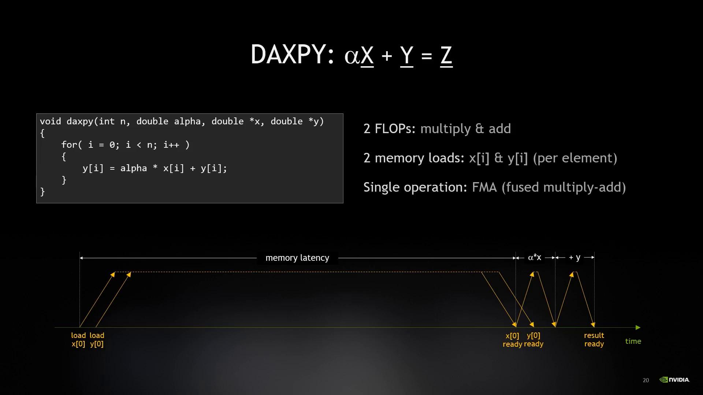

And the problem here is that the memory latency is huge compared to the computer latency. So why? Well, physics, right? The speed of light is really, really fast. Like a good clock is also really, really, really fast. So the single clock tick light travels only 10 centimeters, right? That's four inches to your Americans, but in our SI units come on, it's about time. Anyway, so really the clock is going so fast that light doesn't travel very far. Electricity travels about a fifth as far as light, when it's in silicon. The physics is actually pretty complicated, but this is kind of a decent rule of thumb. That means in a single clock-tech electricity, it is just traveling 20 millimeters. So if you think about the die size of a chip, right, that's one or two clock ticks, simply for electricity to go from one side of the tick to the other. Not even do anything, just literally traveling as fast as it can in a straight line. So when you start seeing reports of processes with latencies of five or six or seven clock cycles of latency. That is astonishing. That is a point where the speed of electricity is competing with the speed of my computer. For the laws of physics are getting in the way. When I have to fetch stuff from memory, memory is five or ten clock ticks away and another five or ten to come back. But actually the problem is not really the distance from my memory.

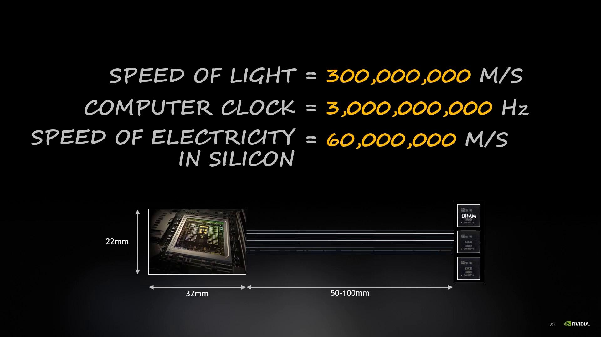

The problem is actually all the transistors are in the way because the way that circuits work is your handing off signals from one bank of transistors to the next as you go through all of the logical operations inside your device. So they switch on or off the clock rate, the electronics only advance as fast as the clock ticks, so it's been a lie as a factor. But it's not the biggest factor. Really the depth of my transistor pipelines is a bigger factor.

So, I'm spending a lot of time waiting for my data. What does it mean? Right? Let me can do some calculations and see what this is costing us. If you remember, I paid too much more CPU because I can't keep my CPU busy. I've got too many flops. And so I want my memory to be running flat out all the time. Right? So, I've picked some numbers for the Xeon 80 to 80. I picked them really just because latency numbers are available for it. It's got 131 gigabytes of memory and a latency of 89 nanoseconds. It doesn't, you'll see it doesn't really matter which specific chip we pick. So this is the top of the line of that family. See on. If I've got 89 nanoseconds and I can move 131 gigabytes per second, that means I can move in one memory latency 11,659 bytes. Pretty good. However, that's the load just x and y. That's two 8 byte values, 16 bytes a day from that time, for a raw efficiency of 0.14%. That is not very good. So even if I've got a high bandwidth memory to fight my computing intensity, barely using any of it, right? I spent way too much money on both my CPU and now my nice high performance memory. So I can chart the latency for the set of processes that we're looking at.

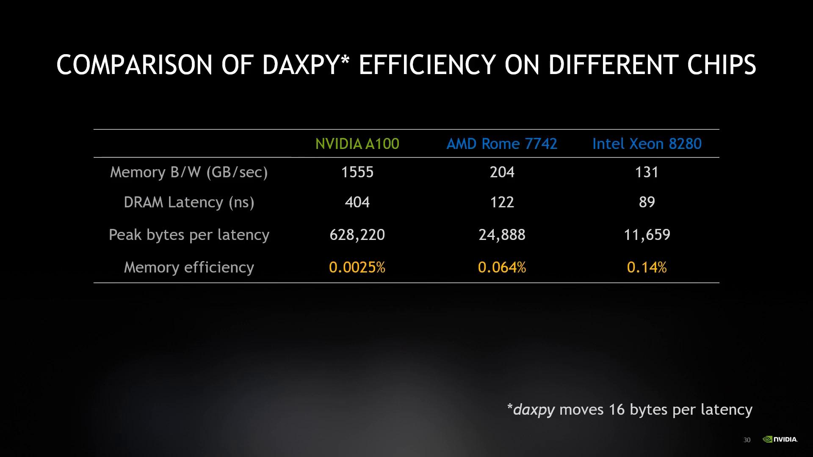

that we're looking at. And you can see that honestly, all of them do terribly. In fact, the 0.14% of the 80 to 80 is the best of the bunch. Right? And this is because my program is what's called latency bound. It's another form of memory limitation. And it actually happens a lot more than you realize. You can see why I don't really care about Fops at all, because I can't keep my bandwidth busy, let alone my flops busy. The GPU interestingly does far, far worse than the rest, right? And this is where the how the GPU programming works part comes in. Obviously I'm going to be elaborating on that a lot more, but let's just talk about what I can do about this problem, right? If I divide 11,659 by the 16, I find I need to be doing 729 simultaneous iterations of Datsby to be able to make it worth the money I spent on my memory, right? So for that low memory efficiency, I need 729 things at once. First we can attack with concurrency. Concurrency is having a lot of things in flight at once. They don't have to be simultaneously, they're just having to be happening independently. Compilers have an optimization called loop unrolling. And that's where they find independent and independent iterations. And they're issued back to back all at once. So they're in fact, we loaded X and Y back to back, and we can do this many times by unwarranted. It's limited fundamentally by how many operations are hard-wacking to keep track off. There's only so many things the hardware can stage in a pipeline before it.

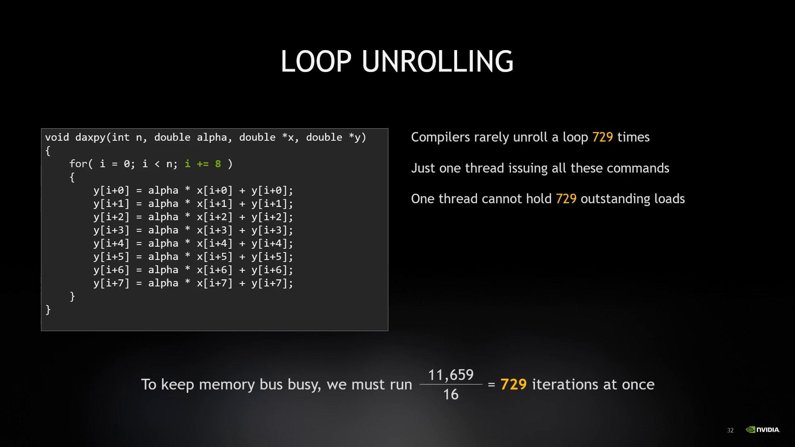

There's only so many things the hardware can stage in a pipeline before it. It just has to wait for things to come back. It's got to track every single request right. So note, I'm also still calculating with just the one thread. So even if I had 729 things on roll, which basically never happens. And my processor could handle 729 not standing load by my thread. I would then have to do 729 calculations at the end. So so new pun rolling is good. It gets me more pipelining, but it's obviously limited by various other pieces of the architecture of them, machine. So, parallelism is stronger than concurrency, right? It means things happen at the same time.

It means things happen at the same time. Things that are in parallel are simultaneous. So, while nupon rolling gave me lots of operations back to back, powers and literally issues one operation by thread simultaneously up to the limit of the hardware however many threads that I want to make a kernel. So in reality, I can do both loop unrolling and multi-threaded operations and that again allows me to use for your thread, but just for the simple sake of this example, let's just look at the hardware limit on how many threads that we can run.

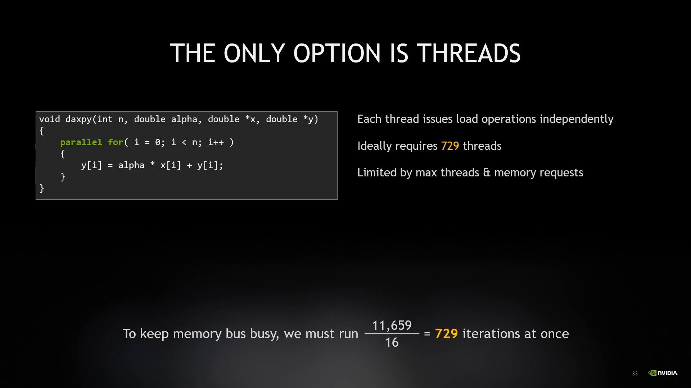

simple sake of this example, let's just look at the hardware limit on how many threads that we can run. So now I can add a few more rows to my table, right? I can look at how many threads do I need in an ideal world to cover the latency of my memory system. It turns out I need a lot. But this is very, really interesting, different from the load of thread. The GPU has a much higher latency and a much higher bandwidth, which means it needs probably 40 times as many threads to cover it, but it actually has a 100 times the number of threads to deal with the processes. So the GPU actually does a lot better. I have five and a half times more threads than I need, whereas the CPU's are just more CPU CPUs. They're in sort of like 1.2-ish type range. This is the most significant design point of GPU. If you remember only one thing from this whole talk, remember this. The GPU has a lot of threads far more than you need, because it's designed for over the description. It's designed to have tons of thread working, so that if some are waiting on memory, there are plenty more left to be active. The GPU is what's called a throughput machine. The design is the GPU put all the results into adding more threads instead of cutting latency. By contrast with the CPU, it's a latency machine. The expectation of the CPU is that a single thread is largely doing all the work. It's expensive to switch out these threads from one to another, so it's a context switch. So you only need just about enough threads to cover the latency. So the CPU designer put all their resources into cutting latency, instead of adding threads, they're two completely opposite approaches to attacking the same latency problem. And this is really the root of the fundamental difference between how the GPU runs work a pretty opposite approach to attacking the same latency problem. And this is really the root of the fundamental difference

And this is really the root of the fundamental difference between how the GPU runs work and how CPU runs work.

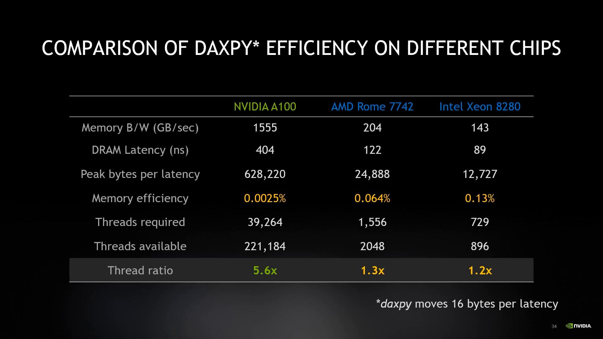

So finally, after 30 slides, I'm starting to tell you about the GPU. I've only been talking about general process of things. And that's because these are the challenges of physics, of electronics. You can see from the previous slide that the GPU solves the same problems completely differently from the CPU, but memory is what matters. All programming is about memory. It's about memory bandwidth. It's about memory latency. It's about where my data is in my memory. But the GPU takes a very different approach. And that is what this talk is all about. That's why I'm telling you about how the GPU, how our GPU program works. So here are the memory numbers. And the story here is cache. Notice I've included the register file as one of the caches. This is actually a really important GPU detail. The GPU, excuse me, the GPU uses a very large number of edges of each thread to keep live data around at a very low latency because it's got a long latency to each one of its different caches compared to a CPU. So it needs memory immediately up close and it needs enough of it to be doing this for long for reasons. There's more than that. When you issue a load operation, you say, exit from some pointer, then the hardware needs a place to put it. So I say load from memory into to put the result in my register so I can compute with it. So the number of registers that I have directly relates to the number of memory operations I can compute with it. So the number of registers that I have directly relates to the number of memory operations I can be doing. This means the GPU can maintain in principle 27 megabytes of outstanding load data. That's the number of total registers in the system. That's 3.3 megadoubles if we want to work in our double position universe of outstanding load data. That's 3.3 megadoubles if we want to work in our double-position universe of outstanding load data. That's huge and it's very, very different from the CPU. The CPU uses resistance for the GPU uses a register for buffer to hide latency, as well as the way to avoid latency

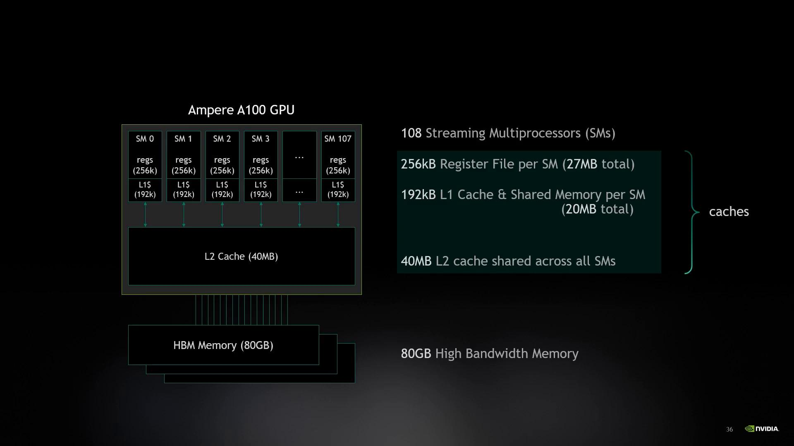

for the GPU uses a register for buffer to hide latency, as well as the way to avoid latency by having its data close up. So a large register count is really fundamental to the way the GPU operates as well. So you've been wondering why I've been talking about threads in bandwidth on cache of the solution. Well, this is why, because threads is actually the reason why we can get away with caches of different latencies. So let's look at the bandwidth in latency. If I imagine GPU main memory, that's that's the high bandwidth in the latency. If I imagine GPU main memory, that's the high bandwidth H, HBM memory. If I imagine GPU main memory, it'll be my unit of bandwidth. You might have a fast ad goes, that's one. Then my L2 cache is three times fast, three times a bandwidth. And likewise, my L1 cache, which is also my shared memory, and I'll get to that in a minute. It's 13 times faster. So my bandwidth, remember, as my bandwidth goes up, it's more easily able to satisfy my computing density. So this is good. I want to be running out of cache if I can be to satisfy my computing test. At the same time, if I look at my L1 cache, the memory that is physically closest to me, if that is a latency of one times. My L2 cache is five times longer, and my main memory is 15 times longer than that. Now, compare this with the off-click panel from latency. And you'll see very rapidly why you really, really want to run the audio data local on your CPU. Moving data across the PCI bus is a this de-bigger bottleneck by far. So we can use all these bandwidths and all the latencies to see what the confusion tends to is like right what the confusion tends to be that's required to operate out of each error memory right my 8 p.m. that was my confusion tends to be 100 that we looked at earlier my L2 cache has a computing tends to far, just 39 operations per node that are needed. And my L1 cache only 8 is a very achievable number. This is why the L1 cache and the shared memory are in the GPU are so useful because I can start. I can actually start having my data close enough

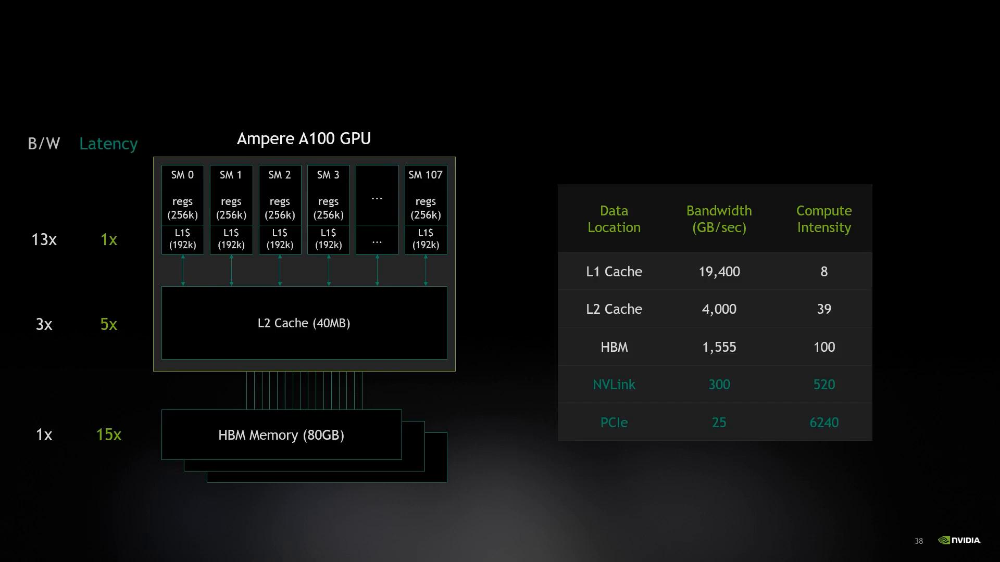

are so useful because I can start. I can actually start having my data close enough that I can meaningfully do eight operations and start saturating my flops. So I really want to be running out of cash if I can be. At the same time, I really really don't want to be running out of PCIe. The bandwidth of PCIe is so bad and the latency is so horrible. But I need to literally do an incredible and inconceivable number of operations. And VLink I've put in here, it's not so important because it's the GPU link. But it's interesting that NVLink is much closer to the main memory domain than the PCI domain. This is why NVLink is a much, much better interconnect between chips and between GPUs than the PCI bus. If we look at the required number of threads to hide this latency, here's an interesting thing, right?

If we look at the required number of threads to hide this latency, here's an interesting thing, right? You'd think that you would need fewer latency, fewer threads, because the latency is calm down. But, remember, that bandwidth is also going up. You need almost the exact same number of threads for my main memory, as I do for my L2 cache, as I do for my L1 cache. And this is no accident, right? If you think about it, you want to be able to keep the entire memory system completely busy all the time, right? Because my computer intensity is high and I need to feed the cause. So if there were one part in this memory system that needed more threads than any other, I would find that that part was a bottleneck. I would have to add more threads to satisfy that part. And then I'd have too many for the other area, too many threads for the other part, so I'm going to add more threads to satisfy that part, and then I'd have too many for the other area, which I took too many threads to be out for the other part, so I'm gonna be a member of the system. It's the hard redesign is intentionally balanced things to make things evenly programable across the whole device.

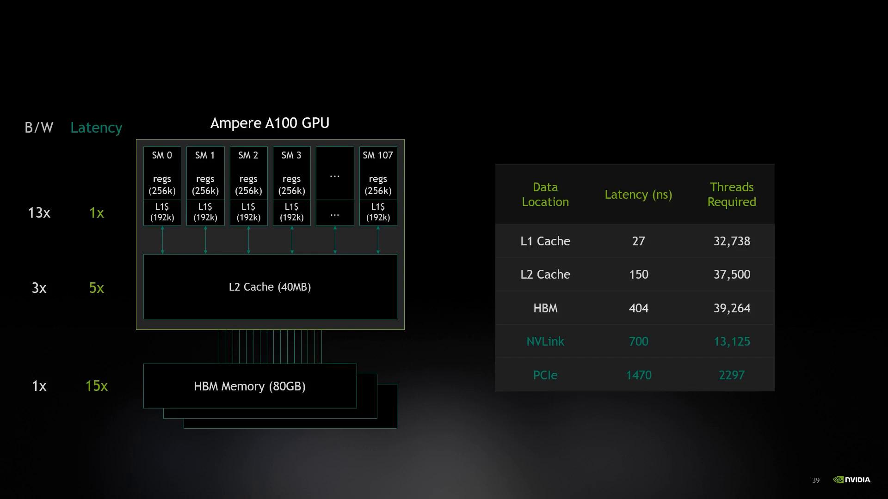

to make things evenly programable across the whole device. So, excuse me, inside the inside each SM, an SM is basically a processing core, I've got 180 of them on the A100 GPU, an SM is a basically a processing core, I've got 108 of them on the A100 GPU. S&M is a basically a processing core and there's a lot going on in here, but effectively the thing to keep in mind is it's running everything in groups of 32 threads called a warp. It's basically the vector width of the machine. 32 threads in the warp and I run four of these at any time. So any given given clock-tech, I've got four warps doing something. I've got 64 warps sitting around waiting. I've got four of those 64 doing something. The GPU is built with all these SMs and all these threads in the S.M. This is part of the whole strategy. Remember, the GPU designers find latency

Remember, the GPU designers find latency by adding threads rather than finding latency by cutting latency down. So I can have a lot more threads in live than a running at any time, 2048 in any given SM, but only 128 in running at a time. Right, this is the idea, I was talking about that the GPU is oversubscribed. So when some threads are off waiting for a relayancy, other threads have presumably received their response a little ready to go. This is the entire secret to how the GPU works. It can switch between what's instantly within a single clock cycle. So there's no context switch overhead at all.

That means it's very important to have way more threads alive than the system can run at any time because this is how you compensate for the latency. It's literally the opposite of the CPU where you never want to have subscribed to your threads. Excuse me. The GPU is a throughput machine.

So let's talk about throughput that's a little bit of a thing to say, those were for a lot. Let me explain them to you for a moment. So I live in San Francisco and I work in Santa Clara. So yes, my commute sucks. And also yes, there is literally a permanent

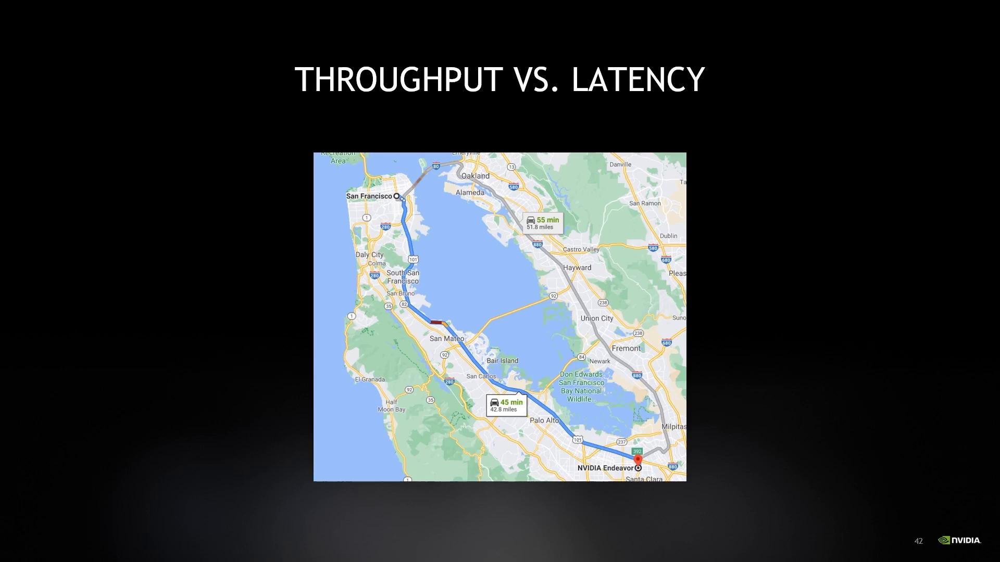

So yes, my commute sucks. And also yes, there is literally a permanent traffic jam just north of San Mateo. So I have two choices of getting to work. I can take my car, which which takes 45 minutes or I can take the train which takes 73 minutes, my car is optimised for latency while the train is a throughput machine.

I'll see how that works.

So the problem with taking the car is it does one thing as fast as possible, but it doesn't really help anybody else. It's fast. It's not very efficient. It only carries a handful of people and it goes from one place to another. The train on the other hand, there's a lot of people. It stops in a lot of places, so you can all go along the line. It helped. I can have a lot of trains along the route.

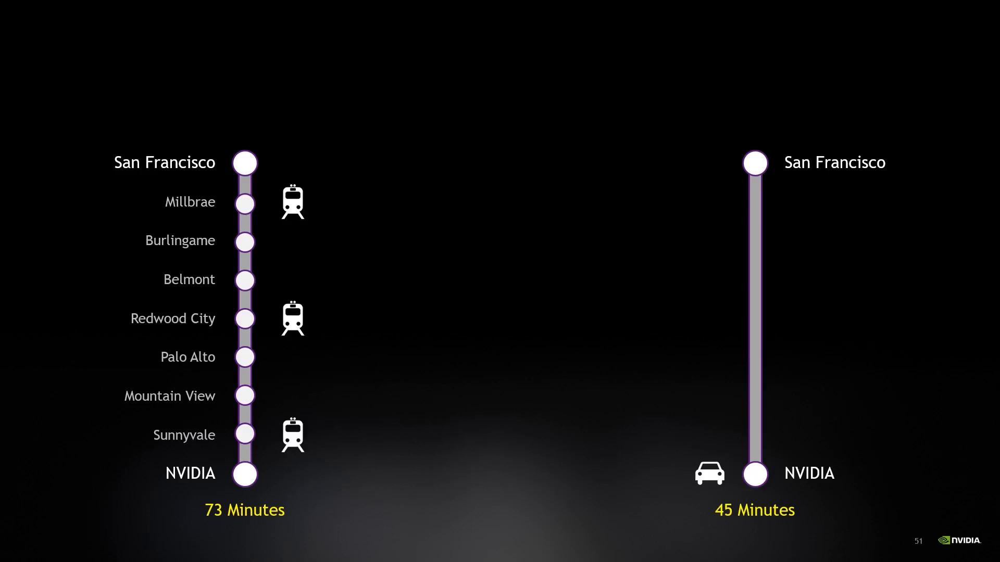

So, nothing about latency systems is that if they get over and subscribe, they're horrible. Everything down to a whole. Right? If I've got too many cars on the road and nobody's going anywhere. The train is full. You just wait for the next one and one, you're late. You're not going to be three hours late. Because there's always another train coming. So, the GPU is a throughput machine. It's designed for way more work than it can run in time. And so, just like if you're trained aren't full, you're not making the best you for the train system. That's true for the GPU as well. So throughput systems want deep queues of workers waiting to go to the train company intentionally keeps you waiting on the platform. Because if it comes to a station and nobody's on the platform, the train isn't full and they're wasting their money. The GPU, just like the train, needs to be kept busy. The CPU is a latency machine. Switching threads is expensive, so you want one thread to run as fast as possible. But if things get congested, everything's stored, right? So the aim is to do everything as quickly as possible, then get out of the way for the next thing. I want my car on the road getting to work off the road, because the road has a number of cars that it can be running.

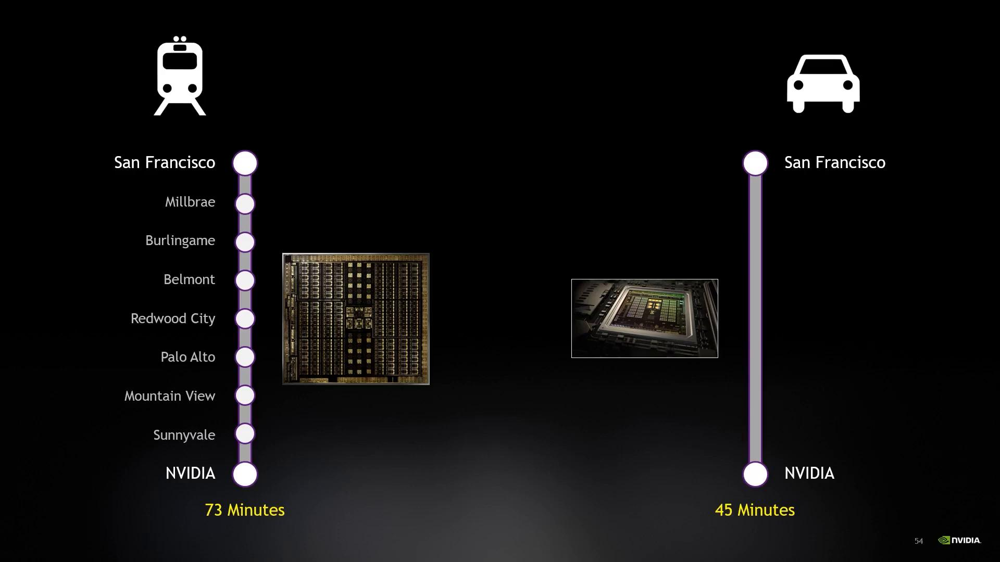

So just to recap, I've got all of these threads to solve our latency problem. And that's great, I've sold our latency problem when I have a gauge panel. Everything, except as a throughput system, I'm always over-subscribed. And being over-subscribed means I always have work to do one memory of being fast. So now I have to think about a sync running. The most important thing to remember is the CPU and the GPU are independent processes. That means that they can work on different things at the same time, and they should work on different things at the same time. If you make your CPU stop or the GPU is running, you make the GPU stop or the CPU is running. It's like everyone having to get off the train at every station, and wait for the next train, and then get back on. You might as well only have one processor. So, asynchrony, nobody stops. The CPU would issue work to the GPU, and that it carries on doing its own thing while the GPU does its thing. You only wait for the end result.

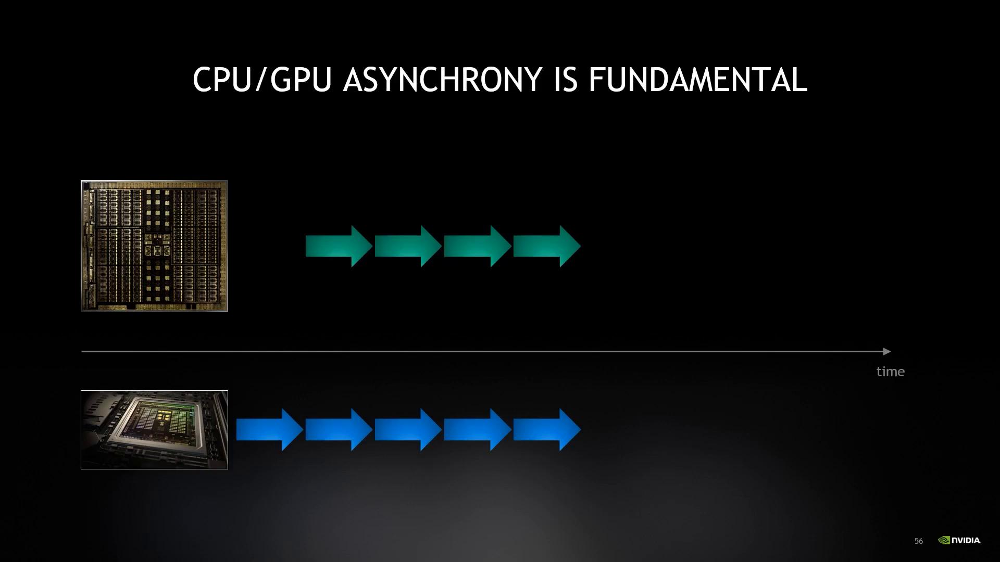

So stretch the energy for a moment probably a little bit too far. If you want to move a lot of things at once, you want a lot of lanes. I just wrote on the right. Your traffic moves asynchronously. Nothing gets blocked by what's ahead because you've got enough flow to be further around on the right stands and it turns to being watched at all. If you're synchronous, you've only got one lane of traffic. Everybody waits for the slowest thing. Everybody waits for everybody else. So asynchronously, it's really important in being able to achieve the throughput that

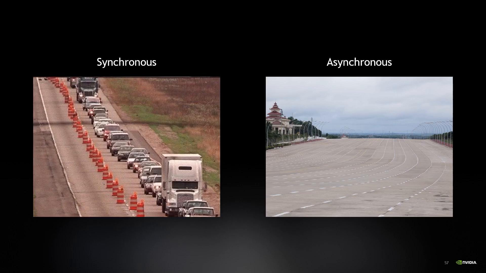

So, in the real world, it's actually rare that you find work, where each element is completely independent from the others.

completely independent from the others. Daxpiers one such example, these are called element-wise algorithms, and only the simplest algorithms tend to work this way. Most algorithms require at least one or more surrounding elements, like convolution, for example, that brings in all of its neighbors. I somehow rooms like the Fourier transform require every element to interact with every other one. These are called all to all algorithms. And each of these behave pretty differently.

Okay, so let me show you how parallel it works on the GPU, how we're going to get the throughput that we need. So let's say I've trained an AI to recognize cats on the internet.

So let's say I've trained an AI to recognize cats on the internet. So here's a picture of the cat.

I'm going to overlay the cat with a grid, and that grid is going to create many blocks of work. I'm going to work separately on each block. It might be the blocks independent from each other. They're working on a different piece of the image. And there are loads and loads of blocks, so the GPU is over-subscribe with them. So remember, remember, there are over-subscriptions of what we want for a few execution and peak memory use. So each block comprises many threads working together,

So each block comprises many threads working together, so that those threads can share data and achieve a joint task. All the threads in the block are running simultaneously in parallel. Right? So now I have my hierarchy. I've got the total work on the left that is broken down through a grid into blocks, which provide the other subscription that GPU needs. And then I've got blocks of a smaller number of local threads, all of which are working together on the task. So now I've trained an AI to process the image for me. Those threads work together. They work on their tile, their block. And remember, each block is running independently, all of their own pace. And eventually my whole image is going to be done. And my internet will be one bit safer.

So work runs on the GPU as a grid of all the work to be done that's broken down into blocks of threads. Each block has parallel threads, a thread which are guaranteed to be running at the same time. So they can share data. But all blocks are scheduled independently in an over-subscription mode. This gets me the best of both worlds. It gets me the throughput that I need to keep the machine busy. But it also allows some number of threads to interact together with each other. This is the essence of GPU programming, is to break your problem down into blocks of things

is to break your problem down into blocks of things where cooperating threads will work together on it, but each of the blocks is relatively independent.

and I can do that because I've got a lot of threads, how many more operations do I need to do? So for the element-wise thing, for example,

So for the element-wise thing, for example, if each time I add a thread, I'm loading a new element of data, but I'm only doing one more operation. So I'm adding one thread, loading one piece of data, doing one more calculation.

So I'm adding one thread, loading one piece of data, doing one more calculation.

So this brings us finally to matrix multiplication. As I say, this is the one algorithm which we really, really care about, but which actually can find this compute intensity. You probably already know what matrix multiplication is, but I'm not going to show what it is. I'm going to show you what the machine thinks of this. Right in the simplest case, I multiply every row of green by every column of blue and I get every dot of white. I'll show you how this works. So first, we extract the row in the column that we want. We've loaded five green values and we've loaded five blue values. Then we multiply each element with this partner and we add the result together with its partners to get the final value. So here's the point, right? Remember how I was telling you about Batsby, how it's got this fused multiply add, is this FMA. Remember I said it's such an important function that most persons have their own instructions especially for it. This is why it's really important. It is a fundamental operation in so many mathematical algorithms. So my matrix multiplies a big complex thing, but it's built up of tons and tons and tons of these tax fees. And this repeats over and over for each output value. Notice how the green row isn't changing. Right there is an example of me reusing what I loaded many, many times. So this matrix 25 times for every green dot loaded. I've just worked with this one row and I've done 25 calculations with it.

I've just worked with this one row and I've done 25 calculations with it. That is some serious compute intensity. If my matrix were 10 by 10, I would be reusing this at the rate of 100 operations per load, which is the computing tensile that I want. Remember? So as my matrix grows, I dramatically improve my ability to start getting my frots busy. So matrix multiplication has an arithmetic intensity,

So matrix multiplication has an arithmetic intensity, which increases as the cube of the matrix size. That's the nature of the matrix multiplication algorithm. At the same time, my number of data loads goes up as the square as my matrix gets bigger. As n gets larger, I have n squared, things that I'm loading. So my arithmetic intensity scaling, my algorithmic complexity, is order n. So here is my plot of how the required compute intensity increases with matrix size, right? As my matrix goes from size 1 to size 64. It's a straight line because an order n scale means it increases monotonically as n increases. So as I make my matrix bigger, I need commensurately more compute intensity to be able to be able to serve as a. Now I can plot the line that shows what the compute intensity is for single precision floating point on the GPU. So the GPU, the M-Perium on GPU, can do about 19 and a half teraflops of GPU computing. And this works out to an error computing intensity of 50. The crossing point tells us, the conflict point tells us that once the matrix size reaches 50, we're fetching all the data that we need to keep the flop, the compute flops busy, is we're fetching all that they can handle. So this is the largest matrix I can do efficiently. Above this size of matrix, my memory is now idle more than the compute course. You want your machine ideally to be balanced, you want to keep everything running 100%. That's really the point of the throughput machine. So the sweet spot is the crossing point on that line. So if I plot double precision, you can see here it's higher because on the A100 we have double precision tensor cores, which give you more floppy for thread. Right, tensor cores into a minute a moment. So you can see that on this chart, right? I maxed out the single, but I'm not maxed out on double, right? So we can zoom out a little bit on this map. I put a green arrow down the bottom, so you can see the n equals 64 span, and we're zooming right out so that that previous graph

and we're zooming right out so that that previous graph is just that lower left corner at them. So larger matrices, you can see the matrix intersects at around 100 compute intensity. So a 100 square matrix is going to be maxing out my double precision. And of course as my matrix size gets bigger, my memory gets more and more and more idle because I'm studying more and more time computing instead. So I really am fighting for this balance point here. So now we can bring in the Tensor course. The Tensor course are custom hardware units built into the SM. Functioning very much like an RF medic unit, like a multiplier and add, but they do an entire matrix operation of matrix multiplier operation in one go. That means they have a ton of flops packed into a single stair. At FMA, the two of the fused multiplier, the two flops for every instruction, these tensor cores do way more flops in that for the instruction. And you can see this yellow line, the computing intensity for tensor flow to 32, the 32-bit tensor core is right up there at 400 because I've just got that many flops. So I'm going to need a ton of memory to fit this to service this. And so my matrix size that I need to begin saturating that is 400. My matrix is much, much, much bigger. And so this is this tension that I've got, right? I want more flops because I want to go faster, but more flops require a bigger problem size, otherwise my memory system is a bottleneck. And bigger problem sizes aren't always possible, so adding more flops on its own, I just run out of room. I like 400 square matrix, because it's a very large matrix.

I really want my flops, but I want them as small a matrix. It's right. I want to have my cake, and I want to eat it. And this is where cash comes in. OK, so let's look at the bandwidths and the latencies.

OK, so let's look at the bandwidths and the latencies. Again, you saw this table before. And now we can look at it for what the tensor core computing tends to be. What is the computing tends to be the theta? I drew that line of 400 in the previous slide for the tensor core. That is what it needs to operate out of,

out of main memory, HBM memory. If I'm operating out of L2 cache, my computer intensity is only 156. And that obviously the shared memory, which is much smaller, is only 32. Right, so I clearly need to be working with cache to get my Tensor cores efficient at smaller matrix sizes. In fact, I can plot this, and you can really start to see why data location matters, right? The smallest matrix I can efficiently do is 400 square when my data is in my main memory. But it's only around 150 when it's in the L2 cache. And my smallest matrix is 32 when it's living in a shared memory, right? Suddenly, I can handle small matrices because I've taken care of where my data is, which was really the title I wanted for this talk. So what have we seen today? We've seen,

which was really the title I wanted for this talk. So what have we seen today? We've seen, we've seen that flops don't matter, but bandwidth does because of computer intensity. And then we learn that bandwidth doesn't really matter as much as latency, because we've made things here as long. And to fix latency, I need a lot of threads. And the GPR-Ccecure is built with this lots of threads in mind, and with oversubscription behind the latency. But you know that I have a miserable commute. And we learned that the GPU is a throughput machine, which needs a subscription instead of being a latency machine, which has a fixed amount of work. In spite of all those threads, sometimes they still need to work together, not everything is element wise. And so the GPU runs threads is a hierarchy, right? A big grid of work broken up into blocks with front and throughput mode, and then threads in the block can work together and cooperate on some operations.

in the block can work together and cooperate on some operations. So with latency beaten, we then turned and looked at how the compute intensity of heavy lifting algorithm like matrix multiply, finally begins to balance compute against bandwidth. And the way to get high efficiency on small compute intensity pieces of work is really to play the cash hierarchy game. I can beat latency with threads and I can beat bandwidth flow with locality and then I can get all the flops even from the tensor course.

I can beat latency with threads and I can beat bandwidth flow with locality and then I can get all the flops even from the tensor course.

which brings me back to my original title, right? Where's my data? Because my ability to max out the efficiency of all the components of my system, my thread, my memory, my compute, is contingent on where the data is to begin with. Right? No compute intensity asks less of me because I can get away with through a thread to hide the latency. And I have more bandwidth to feed the flops, but everything really depends on data. Even my ability to use the flops depends on where my data is. And that's what I got for you. Thank you very much.

