I'm Stephen Jones, one of the architects of CUDA. My role involves conceptualizing how we program GPUs, determining the necessary programming languages, and designing hardware to support these languages. I spend much of my time contemplating the mechanics of computing. This isn't a formal talk; it's more of a sketch I've shared with interns every summer. I thought it might interest you at VTC to see my perspective on GPU functionality and the constraints hardware imposes on programming. You'll be surprised to learn how much the laws of physics and hardware nature dictate our programming methods. Initially, I titled this "4-count GPU computing works," but realized it should be "Where's my data?" because understanding data location is crucial to GPU computing.

Let's start with a potentially contentious claim: nobody cares about FLOPS (floating point operations per second). While FLOPS measure a machine's mathematical power, they aren't the most critical factor. Most people inquire about a machine's FLOPS, but it's not the key question. Only a few care, and one significant algorithm truly depends on FLOPS, which I'll discuss later. But generally, FLOPS aren't a primary concern.

Why shouldn't we care about FLOPS? Consider a modern CPU with detached memory. Memory can supply data at 200 gigabytes per second, while the CPU can perform 2000 giga operations per second. This disparity is typical for modern processors. Memory provides 25 billion double precision values per second, but the CPU demands 2000 billion. This ratio is the device's compute intensity, indicating the work needed to compensate for memory's slower data supply. In this example, 80 operations per data piece are required to keep the processor busy, a challenging task. Few algorithms demand such intensity, except for matrix multiplication, which I'll cover later. Here's a table of various processors, showing similar compute density, which is problematic for programming. Interestingly, Nvidia chips have more slots and higher memory bandwidth, balancing compute intensity. This isn't accidental. We aim to minimize compute intensity because no algorithm can handle 100 or 144 operations per load. The computing secret is that FLOPS increase faster than memory bandwidth each generation, raising compute intensity. Programming constantly battles to keep neural networks busy, as they require more data. Much of what I'll discuss involves these challenges and their impact on programming.

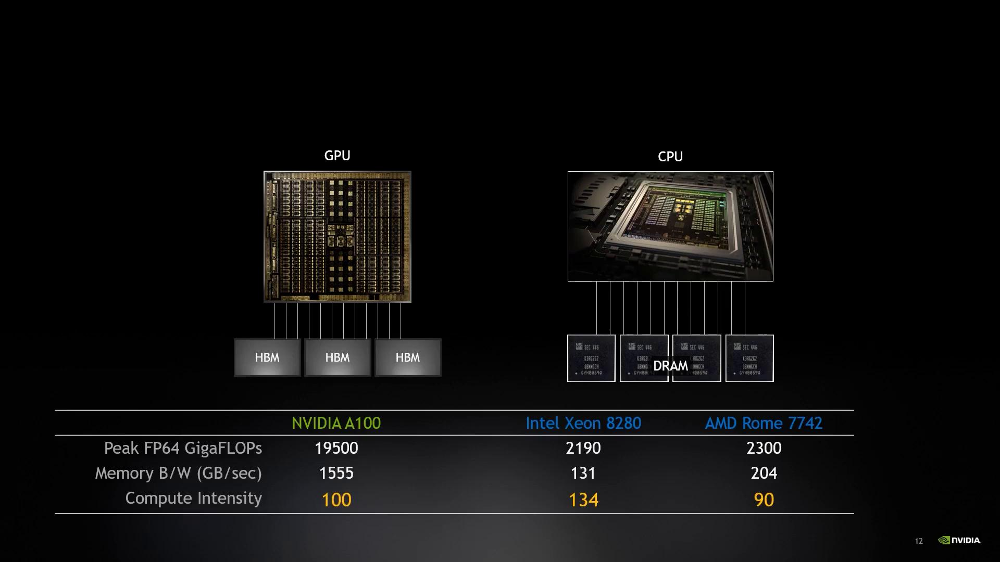

The reason FLOPS don't matter is that we already have enough, and it's worsening. If the CPU isn't busy, it's in a memory bandwidth-limited mode, which most programs experience. I estimate over three-quarters of programs are memory bandwidth-limited. Achieving 100 operations per load is difficult. But that's not the whole story. We should focus on latency, bandwidth, and FLOPS. Let me explain memory latency.

Why care about memory latency? Consider the simplest operation, a*x + y, known as DAXPY in double precision or SAXPY in single precision. Many benchmarks exist, but they're often misleading. This operation is fundamental, so processors have a dedicated instruction, FMA (fused multiply-add), to perform it in one step. I focus on loads, not stores, because stores don't require waiting. Loads must be balanced against FLOPS to cover loading time. Let's examine a timeline: first, load X, then load Y, which doesn't depend on X. Then, wait a long time for X to return. Once X is back, start alpha times X, which takes less time than latency. By the time alpha times X is ready to add to Y, the Y-load has arrived, effectively for free. This is pipelining, where extra memory operations are hidden by other work. Pipelining is fundamental to programming. Compilers optimize by issuing loads early to cover them with computation. This pipeline is crucial for program optimization because memory is vital. The problem is memory latency is much larger than compute latency.

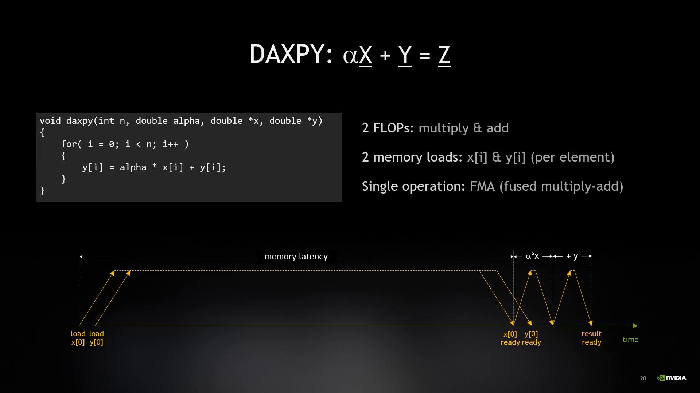

Why is memory latency so large? Physics. Light travels only 10 centimeters per clock tick, and electricity travels a fifth as far in silicon. This means electricity travels 20 millimeters per clock tick. A chip's die size requires one or two clock ticks for electricity to cross it. When processors report latencies of five to seven clock cycles, it's astonishing. The speed of electricity competes with the computer's speed, and physics limits us. Fetching from memory takes five to ten clock ticks each way. But the real issue isn't distance; it's the transistors in the way. Circuits hand off signals through transistors, advancing only as fast as the clock ticks. The depth of transistor pipelines is a bigger factor than distance.

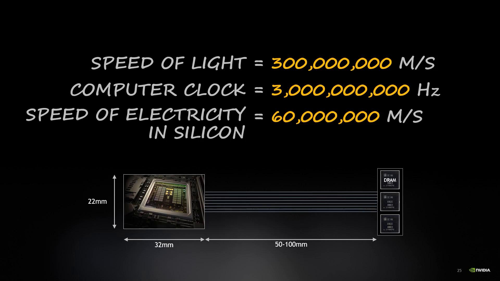

I'm spending a lot of time waiting for data. What does this mean? Let's calculate the cost. I overpaid for my CPU because I can't keep it busy. I have too many FLOPS, so I want memory running at full capacity. I chose numbers for the Xeon 8280 because latency data is available. It has 131 gigabytes of memory and 89 nanoseconds latency. The specific chip doesn't matter. With 89 nanoseconds and 131 gigabytes per second, I can move 11,659 bytes per memory latency. But that's just loading X and Y, two 8-byte values, for 16 bytes total, yielding 0.14% efficiency. That's poor. Even with high bandwidth memory, I'm barely using it. I overspent on CPU and memory. I can chart latency for the processors we're examining.

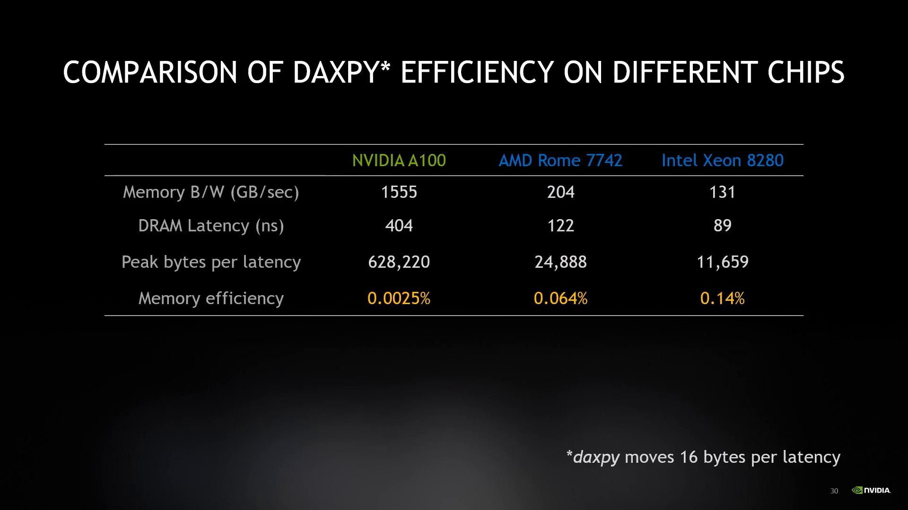

All processors perform poorly, with the 8280's 0.14% being the best. This is because my program is latency-bound, another memory limitation form. It occurs more often than realized. This is why I don't care about FLOPS; I can't keep bandwidth or FLOPS busy. The GPU performs worse, which I'll elaborate on. Let's address this problem. Dividing 11,659 by 16, I need 729 simultaneous DAXPY iterations to justify my memory investment. For low memory efficiency, I need 729 concurrent tasks. We can tackle this with concurrency, having many tasks in flight independently. Compilers optimize with loop unrolling, issuing independent iterations back-to-back. This allows loading X and Y back-to-back multiple times. It's limited by hardware's ability to track operations. There's a limit to how many tasks hardware can stage before waiting for returns. I'm still using one thread. Even with 729 unrolled tasks, which is rare, my processor must handle 729 outstanding loads per thread, then perform 729 calculations. Loop unrolling aids pipelining but is limited by machine architecture. Parallelism is stronger than concurrency, meaning tasks occur simultaneously.

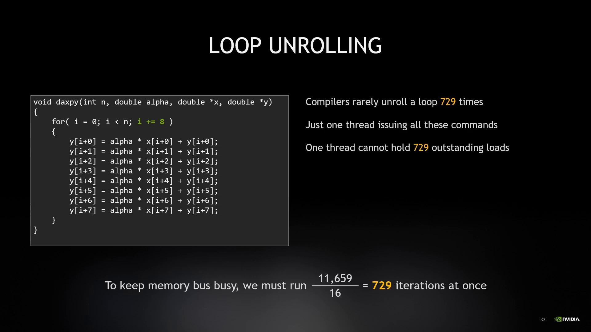

Parallelism means tasks occur simultaneously. While loop unrolling provides back-to-back operations, parallelism issues one operation per thread simultaneously, up to hardware limits. In reality, I can combine loop unrolling and multithreading for better thread utilization. For simplicity, let's examine hardware thread limits.

Let's examine hardware thread limits. I can add more rows to my table, showing the ideal thread count to cover memory latency. It turns out I need many threads. The GPU has higher latency and bandwidth, requiring 40 times more threads, but it has 100 times more threads available. The GPU performs better, with 5.5 times more threads than needed, while CPUs are around 1.2 times. This is a key GPU design point. Remember this: the GPU has many threads, more than needed, designed for oversubscription. It ensures active threads even when others wait for memory. The GPU is a throughput machine, focusing on adding threads instead of reducing latency. In contrast, the CPU is a latency machine, relying on a single thread for work. Switching threads is costly, so CPUs focus on reducing latency, not adding threads. These are opposite approaches to the same latency problem, highlighting the fundamental difference between GPU and CPU operation.

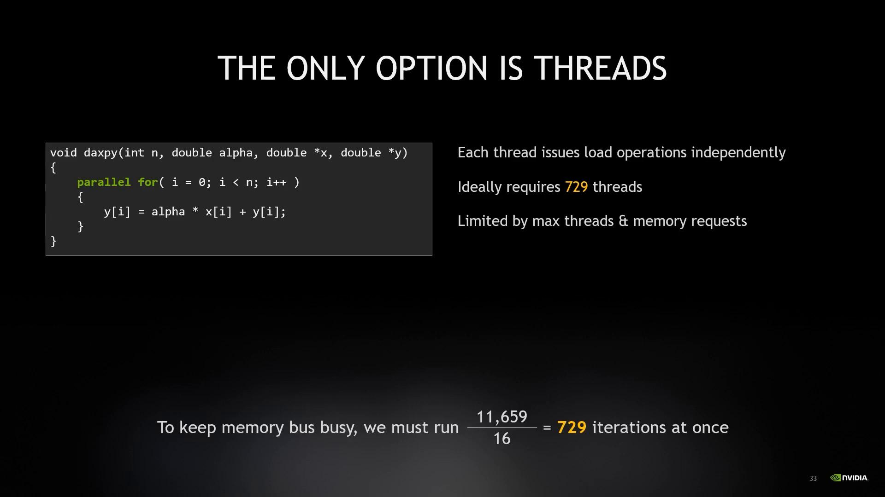

This is the fundamental difference between GPU and CPU operation.

Finally, after 30 slides, I'm discussing the GPU. I've covered general processing challenges due to physics and electronics. The GPU addresses these differently than the CPU, but memory is crucial. Programming revolves around memory bandwidth, latency, and data location. The GPU's approach is distinct, which is the focus of this talk. Let's examine memory numbers and cache. The register file is a cache, crucial for GPUs. GPUs use many registers per thread to keep data at low latency, compensating for longer cache latencies compared to CPUs. Immediate memory access is essential. When issuing a load, the hardware needs a destination, typically a register, for computation. The number of registers relates to memory operations. GPUs can maintain 27 megabytes of outstanding load data, or 3.3 megadoubles in double precision. This is significant and differs from CPUs. CPUs use resistance, while GPUs use registers to hide latency and keep data close. A large register count is fundamental to GPU operation. Threads and bandwidth are key to managing cache latencies. Let's explore bandwidth and latency.

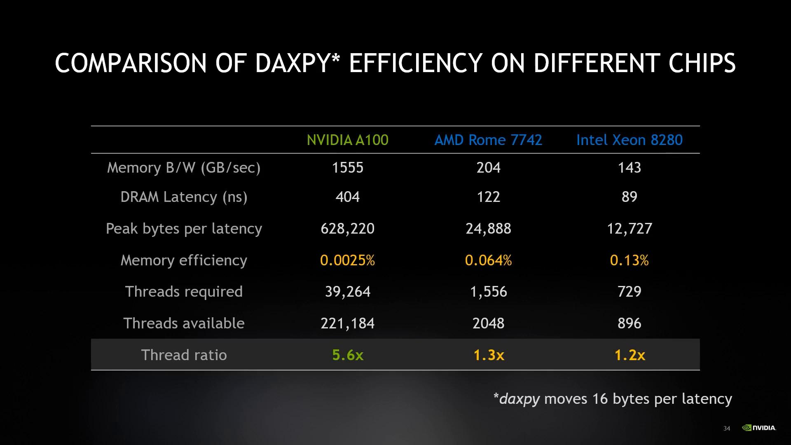

Let's explore bandwidth and latency. GPU main memory, or HBM, is high bandwidth. L2 cache is three times faster, and L1 cache, also shared memory, is 13 times faster. Higher bandwidth satisfies compute density, so running from cache is ideal. L1 cache has a latency of one, L2 is five times longer, and main memory is 15 times longer. Compare this to off-chip latency, and it's clear why local data is preferred. PCIe is a major bottleneck. NVLink is closer to main memory than PCIe, making it a better interconnect. Let's examine thread requirements to hide latency.

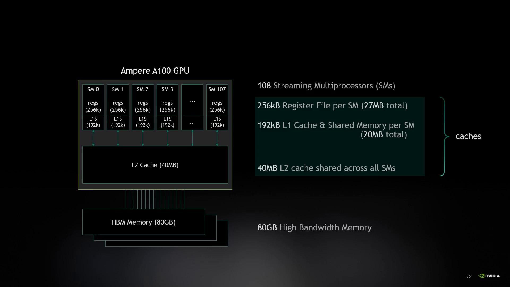

Let's examine thread requirements to hide latency. You might expect fewer threads due to reduced latency, but bandwidth increases too. The same thread count is needed for main memory, L2, and L1 cache. This balance is intentional, ensuring the memory system remains busy. If one part required more threads, it would become a bottleneck, necessitating more threads and causing imbalance. The design ensures even programmability across the device.

Inside each SM (streaming multiprocessor), essentially a processing core, there are 108 on the A100 GPU. SMs run groups of 32 threads, called warps, the machine's vector width. Four warps run simultaneously, with 64 waiting. The GPU's design involves many SMs and threads, part of the strategy. GPU designers address latency by adding threads, not reducing it. More threads can be live than running, with 2048 per SM but only 128 active. This oversubscription ensures active threads when others wait. The GPU's secret is instant thread switching, with no context switch overhead.

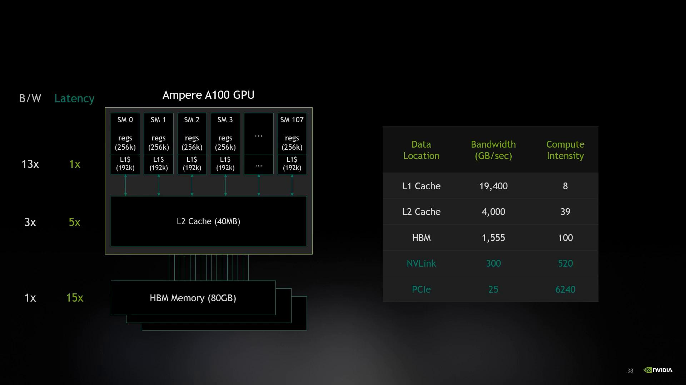

It's crucial to have more live threads than the system can run to compensate for latency. This contrasts with CPUs, where oversubscription is avoided. The GPU is a throughput machine.

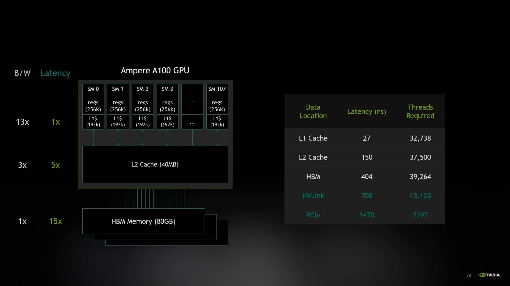

Let's discuss throughput. I live in San Francisco and work in Santa Clara, so my commute is challenging. There's a permanent traffic jam north of San Mateo. I can drive, taking 45 minutes, or take the train, taking 73 minutes. The car is optimized for latency, while the train is a throughput machine.

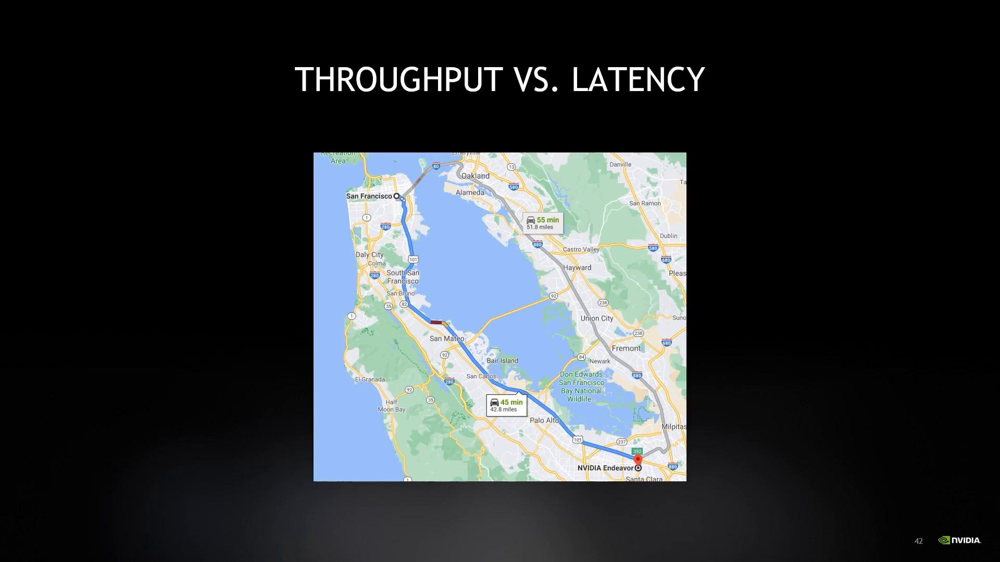

The car does one thing quickly but isn't efficient for others. It's fast but carries few people. The train carries many, stops frequently, and allows more trains on the route.

Latency systems struggle when oversubscribed, causing gridlock. Too many cars halt traffic. A full train means waiting for the next, but delays are minimal. The GPU is a throughput machine, designed for more work than it can handle. Like trains, it needs full loads for efficiency. Throughput systems require deep queues of waiting workers. Train companies keep you waiting to ensure full trains. The GPU, like a train, must stay busy. The CPU is a latency machine, where thread switching is costly. One thread runs quickly, then yields to the next. The goal is fast execution and minimal congestion.

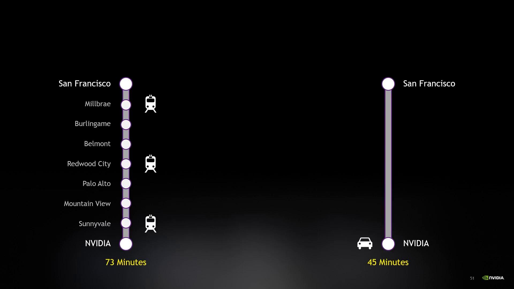

To recap, threads solve latency issues. The throughput system is always oversubscribed, ensuring work is available when memory is fast. Asynchrony is vital. The CPU and GPU are independent, working on different tasks simultaneously. Stopping one for the other is inefficient, like disembarking a train at every station. Asynchrony means no stopping; the CPU assigns tasks to the GPU and continues its work, waiting only for results.

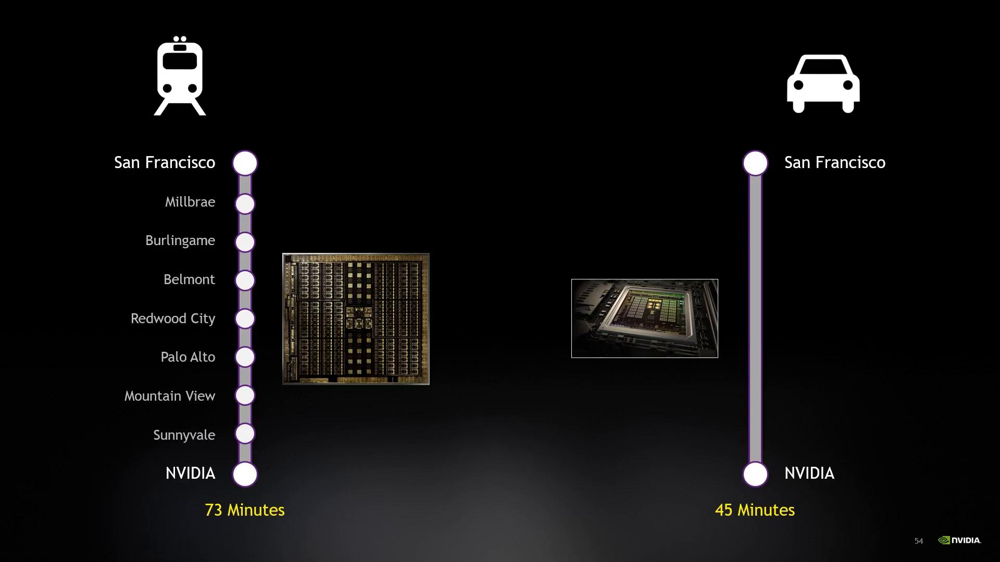

Asynchrony is crucial for throughput. In synchronous systems, one lane of traffic means waiting for the slowest element. Asynchrony allows multiple lanes, preventing blockages.

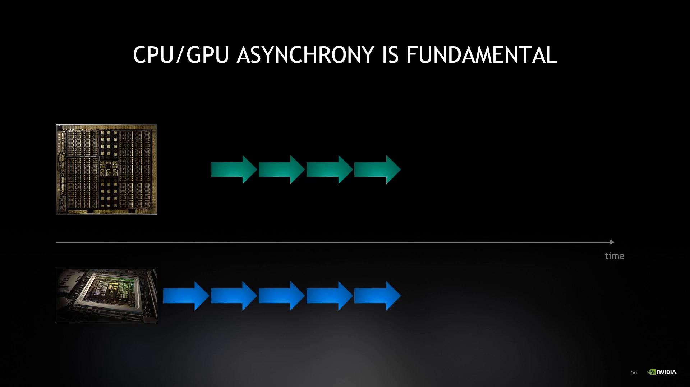

In reality, work rarely involves completely independent elements. DAXPY is an example of element-wise algorithms, where each element is independent. Most algorithms require neighboring elements, like convolution, or all-to-all interactions, like Fourier transforms. These behave differently.

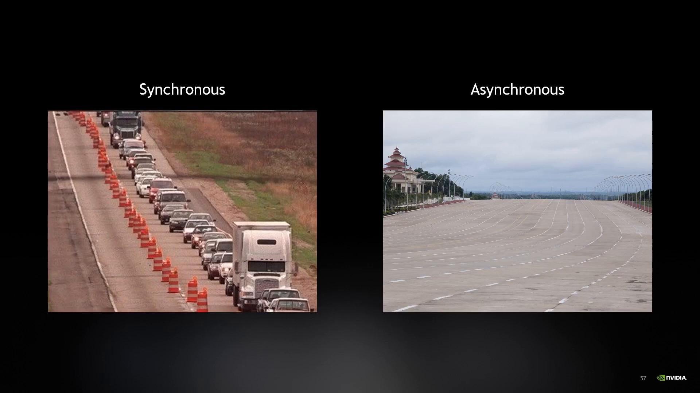

Let's explore GPU parallelism and achieving throughput. Suppose I've trained an AI to recognize cats online.

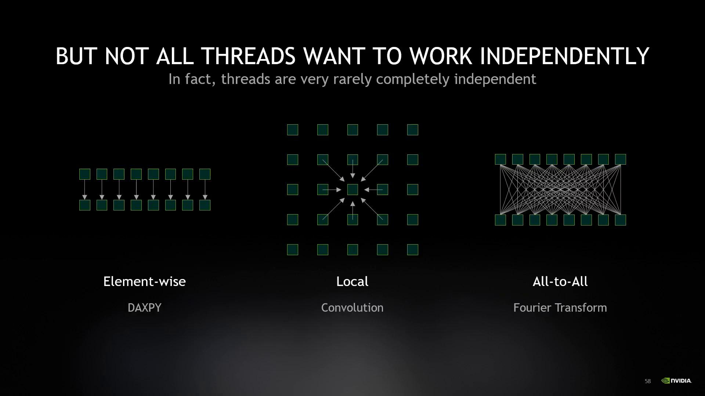

Here's a cat image. I'll overlay it with a grid, creating work blocks. Each block is independent, working on different image parts. The GPU is oversubscribed with blocks, ensuring execution and peak memory use. Each block contains many threads working together.

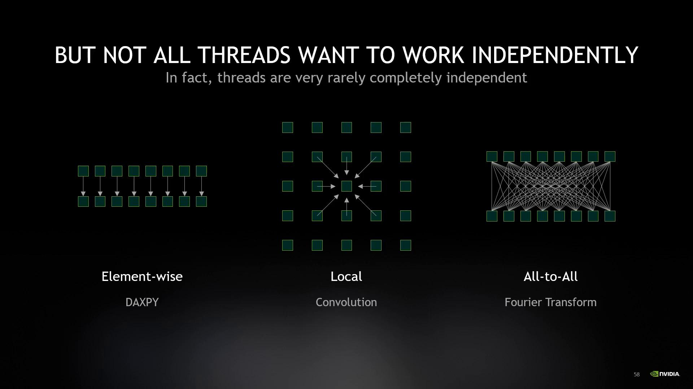

Each block contains many threads working together, sharing data for a joint task. Threads in a block run simultaneously in parallel. The hierarchy involves total work divided into grid blocks, providing GPU oversubscription. Blocks contain local threads working together. The AI processes the image, with threads collaborating on their block. Each block runs independently, completing the image and enhancing internet safety.

GPU work involves a grid of tasks divided into thread blocks. Blocks have parallel threads sharing data, while blocks are scheduled independently in oversubscription mode. This balances throughput and thread interaction. GPU programming involves dividing problems into independent blocks with cooperating threads.

GPU programming involves dividing problems into independent blocks with cooperating threads.

For element-wise tasks, adding a thread loads a new data element and performs one calculation. Each thread adds one data load and one operation.

Each thread adds one data load and one operation.

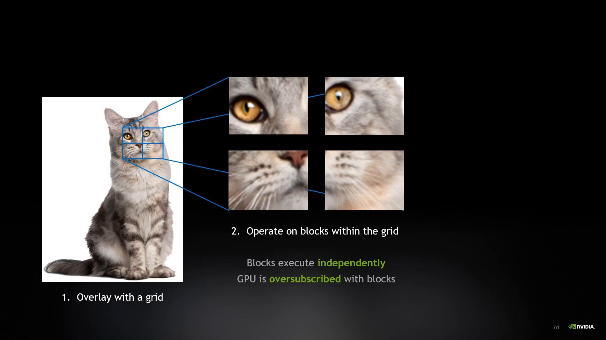

Now, let's discuss matrix multiplication, an algorithm that truly requires compute intensity. You likely know matrix multiplication, but I'll explain the machine's perspective. In the simplest case, multiply each green row by each blue column to get white dots. Here's how it works: extract the desired row and column, load five green and five blue values, multiply each pair, and sum results for the final value. The key is the FMA (fused multiply-add) instruction, crucial for many algorithms. Matrix multiplication is complex but consists of many DAXPY operations, repeating for each output. Notice the green row remains constant, reused many times. This matrix is reused 25 times per green dot, achieving high compute intensity. A 10x10 matrix reuses at 100 operations per load, the desired compute intensity. Larger matrices improve flop utilization. Matrix multiplication's arithmetic intensity increases with matrix size cubed. Data loads increase with matrix size squared. Arithmetic intensity scales with order n. Here's a plot of required compute intensity versus matrix size, showing a straight line due to order n scaling. Larger matrices need more compute intensity. The GPU's single precision floating point compute intensity is 50. The crossing point indicates the largest efficient matrix size, where memory and compute balance. Beyond this, memory idles more than compute. Ideally, balance keeps everything at 100% utilization. The sweet spot is the crossing point. Double precision is higher due to A100's double precision tensor cores, offering more flops per thread. Let's zoom out to see larger matrices.

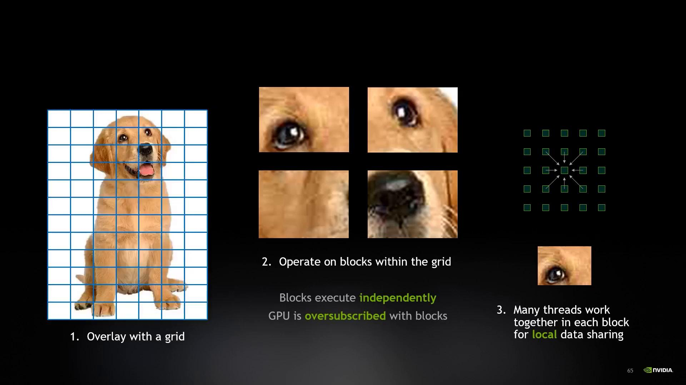

Zooming out, larger matrices intersect at 100 compute intensity. A 100x100 matrix maxes out double precision. As matrix size grows, memory idles more due to increased computation. Balancing is crucial. Tensor cores are custom hardware in SMs, like arithmetic units, performing entire matrix operations in one step. They pack many flops into a single instruction. Tensor cores require significant memory to operate efficiently. The matrix size needed for saturation is 400, much larger. This tension arises from wanting more flops for speed, but larger problem sizes are needed to avoid memory bottlenecks. Larger problems aren't always feasible, so more flops alone can be limiting. A 400x400 matrix is large.

I want flops with smaller matrices, a challenge. This is where cache comes in. Let's examine bandwidths and latencies.

Let's examine bandwidths and latencies. Previously shown, now consider tensor core compute intensity. The line of 400 indicates tensor core requirements for main memory operation. L2 cache reduces compute intensity to 156, and shared memory to 32. Cache is essential for tensor core efficiency with smaller matrices. Data location matters. The smallest efficient matrix is 400x400 in main memory, 150x150 in L2 cache, and 32x32 in shared memory. Cache enables small matrix handling, aligning with the talk's intended title. What have we learned?

We've learned FLOPS don't matter, but bandwidth does due to compute intensity. Bandwidth matters less than latency, which requires many threads. GPUs are designed with oversubscription to hide latency. Despite threads, cooperation is needed, as not all tasks are element-wise. GPU threads form a hierarchy: a work grid divided into blocks for throughput, with threads cooperating within blocks. With latency addressed, we examined compute intensity in matrix multiplication, balancing compute and bandwidth. High efficiency in low compute intensity tasks relies on cache hierarchy. Latency is beaten with threads, bandwidth with locality, maximizing flops, even from tensor cores.

Latency is beaten with threads, bandwidth with locality, maximizing flops, even from tensor cores.

This brings us back to the original title: "Where's my data?" Maximizing system efficiency—threads, memory, compute—depends on data location. Low compute intensity requires fewer threads to hide latency and more bandwidth for flops, but data location is key. Even flop utilization depends on data location. Thank you.

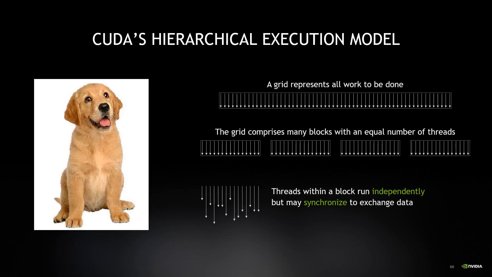