Hi, I'm Stephen Jones, and I'm one of the architects of CUDA. I've been working on the CUDA programming model and GPU computing since 2008. One of the best things about this job is that CUDA is really a co-design between hardware and software. Since CUDA is the way you program the GPU directly, it's vital that we give access to every last bit of performance that's available. At the same time, we're incredibly aware that programming a massively parallel machine is complex. So, the single most important priority for me is always making it programmable for you. It's an interesting tension, and one of the ways that comes out is that there are key performance elements you need to take into account, even while the bulk of your program can be pretty naive C++. I'm not going to teach you CUDA today; there's not enough time for that. But I'll teach you a few things that I think are vital to think about when you're programming the GPU. I think the most important thing when doing any engineering is to have an accurate mental model of the system that you're using. For a clear mental model, I really think the best way to understand the how of something is to know why it's that way. So this talk is really about why CUDA is the way that it is, not just how.

So, that's a good question. Why is CUDA the way it is? It's the way it is because of the laws of physics. Quite literally. So, what do I mean by that? Well, if you're using a GPU because you want performance of some kind, CUDA's design is intended to allow you to get maximum performance on the GPU. It's obviously, as I said, also designed to make it programmable. Performance is limited by the laws of physics. I'll get to that in a moment. So, CUDA is designed to do its best to help you work with the hardware, within the laws of physics, to get good performance. This is actually a really interesting point to make. You see, what's special about CUDA is that we make both the programming language for the hardware and the hardware that runs the programming language. This means not only do we get to adjust the programming language to match what the hardware can do, but we also get to adjust the hardware so that it's more programmable. The hardware designers come up with really clever stuff to overcome limitations like the speed of electricity and silicon, and CUDA evolves to allow this clever stuff to be programmable. Literally speaking, CUDA is shaped by the laws of physics. So I made another possibly contentious statement that I wanted to look at more closely for a moment. I gave a whole talk basically about this at GTC last year, and I put the link below as a shameless plug for my talk, but also because if you're interested, it gives you a lot more detail than I'm going to get into right here about hardware and overcoming physical constraints. Anyway, I won't repeat the whole thing, but I will bring up the main points.

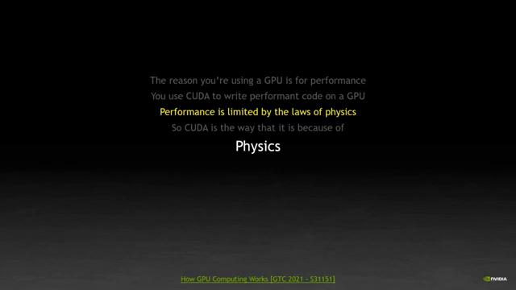

Let's start with this thing though because presumably you paid money and are investing time in GPU computing because you want performance from it. So let's look at what that means. I'll make up what I hope is an uncontroversial statement: getting the best performance is about using all the GPU resources that you can. In other words, the more threads I'm running, the more memory I'm moving, the more calculations I'm making, the better I'm probably doing. So these are the feeds

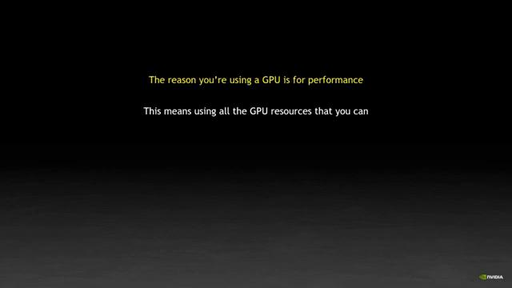

In other words, the more threads I'm running, the more memory I'm moving, the more calculations I'm making, the better I'm probably doing. So these are the feeds and speeds of the Ampere GPU. And the obvious performance metric to look at is FLOPS. It has a ridiculously large number of FLOPS. It's almost 10 teraflops of double precision performance, almost 20 of single precision, and that's not counting the tensor cores, which are way too complex to get into here and normal FLOPS of work. So let's discuss. It's easy to say that the more of those FLOPS your application is getting, the better you're doing. And there's no question about it, but very often it's not actually the FLOPS that are limiting the performance that your application is able to get.

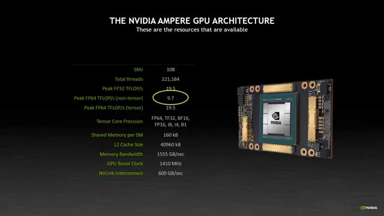

There's usually more FLOPS than you need. We tend to have FLOPS. It's a lot. For reference, this single chip is more powerful than the biggest supercomputer in the world, from 21 years ago. The ASCI White supercomputer was 200 cabinets. It weighed over 100 tons, and it was about 3 quarters of a powerful look. There's this tiny little piece of silicon. It's nothing else. This is a testament to me as well. It's truly amazing, but it means that this thing that you have here has all of the capability, all of the power of that giant machine, and you've got it all at your fingertips in one shape. And I hope we've evolved much more now to get to a point where it's easy to program, easy to access that kind of performance. But that 20 years ago, the scale was an entire room. But I'd like to argue that FLOPS doesn't matter. Memory bandwidth is what matters. I mean, yeah, you want the compute performance, but that's not what limits you. And that's almost never what ends up defining how your CUDA program works.

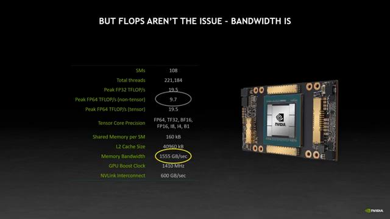

Let's look at a schematic of the A100 GPU here on the right. It has 108 SMs connected to the memory system and each SM, which is sort of core at one of the core of the machine, each SM can request 64 bytes of memory per clock, and a clock speed of 1410 megahertz, that's almost 10 terabytes of memory requested per second. By contrast, the incredibly fast HBM2 memory system can provide over one and a half terabytes of memory per second. That's an enormous amount of memory bandwidth, but it's still over six times less data than the SM itself wants to pop all the SMs together, want to pull in. So there's just no way to feed data into the GPU at the rate that it can request it. And even the rate it can request it is not enough to saturate all the FLOPS that it has available with that's another story, right? It means we're almost always limited by memory performance and not by the threads being unable to keep up with the data. If you're not keeping your threads busy, you're not getting the most done that

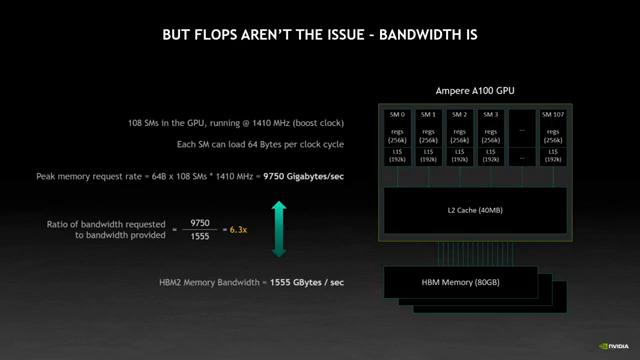

So, if I'm looking at the rate I can feed data into my system purely from a memory standpoint, which is not completely representative because obviously I have data reuse and there's other factors we've going to focus. But if I just look at what a program that needs to suck in data and process that data as fast as it can, the limit is going to be this one and a half terabytes per second of data. Right? And if I do the division, that's 194 billion double precision values per second, giving me a peak performance based on memory of just 194 gigaflops. Right now, I'm only beating the 1996 biggest computer in the world.

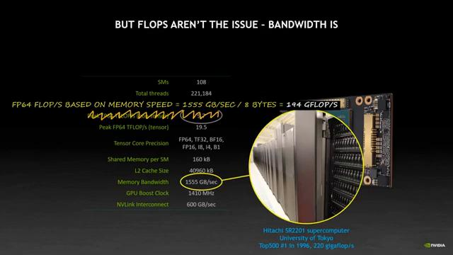

So, let's have a look at this, this memory thing. Let's have a closer look at how it works. Because it's so important in the performance of the machine. A single bit of memory is a capacitor. And either holds a charge for a one bit on the left, or it's empty for a zero bit. The memory is read by switching on the transistor which connects it to a wire in the bit line. The wire then carries a voltage based on the charge in that capacitor. So the wire records either an on or an off for one or a zero.

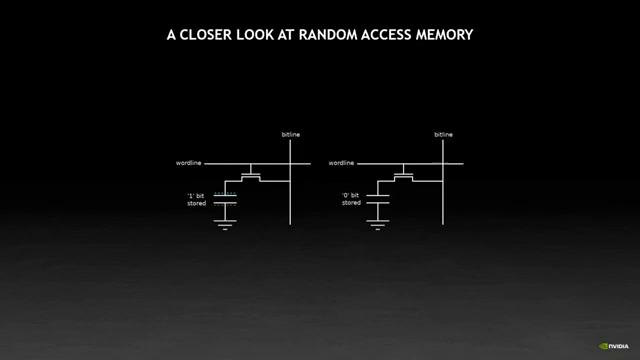

The DRAM chip consists of millions of these cells all connected together in a big 2D matrix. This matrix layout lets me access any row, any column. And this is why it's called random access memory. That's the random access part, as against, say, a magnetic tape which has a linear access. Data is addressed by a row and a column index, which are taken from the requested address. First, the row is accessed. All the cells in the row are activated and their state is copied up to these things called the sense amplifiers. The sense amplifiers read the tiny charges on each of the capacitors in the cells and turn them into a well-defined voltage that can much more easily be read in the next step. The problem is that the charge in the capacitor is drained as this happens, right? I'm connecting a wire to the capacitor, it's draining all the electrons out. And so the data in the row is destroyed. I'll come to that in a moment. Next, the column access takes place. Instead of reading from memory cells, that row is already in the amplifier. So it reads the data held in the amplifier. This is much quicker, much easier to read than a row, because the amplifiers are producing a strong, clear signal. And so I can read much more quickly. You can read repeatedly from the amplifiers because they hold that voltage. You can read as many times you like from the first row. So if you can open a row and use it repeatedly, then you're not having to deal with the capacitance term. Because it's so common in fact to read adjacent memory locations in a row, there's this thing called a burst mode, where a single request returns a multiple worth of data. This is a huge deal because it means I don't have to pay for the individual requests over and over again. And pretty much every processor in the world uses this because the cache system of the processor is always going to go and read multiple bytes at a time and then GPU the cache system is 128 bytes at a time. I'll talk about the cache in a bit. The problem is that when I need to read another row, I first have to write back the data which was held in the amplifiers. If you remember, the row was drained when it was copied into the amplifiers, because the capacitors discharged. So we now have to rewrite it to avoid memory corruption. So this makes a page switch expensive, because it involves both the write back and then a new row load into the amplifiers. And hardware, of course, thinks of rows or pages pretty much interchangeably. So if you hear the term page, then this is what they mean. They mean a row, do you remember? Switching page is about three times as expensive as switching column within a page because of this load and store operation. I'm sorry, store and load operation.

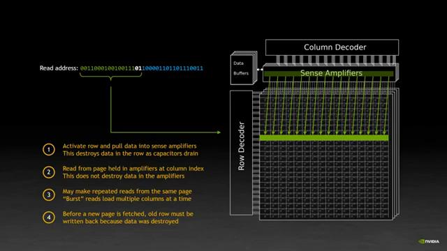

So putting a couple of numbers to this and these are just some HBM numbers I found online, but they represent the kind of scale we're talking about. The rate at which you can load up and read a value from your DRAM depends on the physical time it takes to charge and discharge capacitors. I've got to open a row which involves discharging capacitors. I've then read a column and then when I switch row, I've got to recharge them all. Row read takes three times as long, because I just have to do the rewrite before I load the new page into the amplifiers, which means I all go way faster when I read adjacent data values. One column, when I read striated data values, long rows, my data read pattern matters because of the physics of the random access memory capacitors.

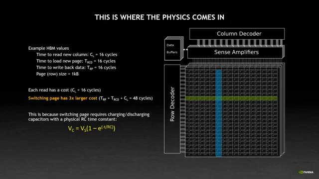

This in mind, we ran an experiment to look at what this physics was doing. And in this experiment, we read eight byte value. Each with an increasing stride, right? So a stride of eight is on the x-axis, is a byte value right next to each stride of eight is on the x-axis is an eight-value right next to each other. 16 is every other value. And so on out to striding by skipping 1,000 values, which is an 8.8, 1.928 kilobytes stride. I've left the x-axis in bytes, because it relates better to what I was just showing you a moment ago. And there's a lot of really interesting stuff in this chart. For example, you can tell the page size is one kilobyte. Because when the stride goes from 512 to 1024 bytes, I'm now only getting one value per page. And you can see the bandwidth drop there. It did literally half. Because I was reading two things from each row access now meaning one thing from each row access. Likewise, at the top left-hand corner of the graph, just by reading every other value, going from a stride of 8 to 16, I'm dropping by half. And that's because every time I open a row, I'm only reading every other value. And so half of my row is now wasted, but I can't open less than a row. But I'm most interested in how low things go on the right-hand side of the graph, because this tells me how much impact I can see from not being careful about my memory accesses, or from being forced to have bad memory accesses. In effect, when my stride gets long, it's like I'm reading random locations, and constantly opening and closing pages and issuing individual requirements to single values. The result is that my effective bandwidth drops by 92 percent. That is enormous. That is a factor 13 loss of bandwidth. So if my achieved performance mainly depends on my memory performance as I was arguing earlier, your memory access pattern can cost you literally almost everything. In this case, a 10-teraflop A100 is being fed data at about 14 gigaflops, that's a factor a thousand off. This is a really important result because it affects everything about the way I program CUDA. I care more about memory layout than anything else, because no other optimization I do can come close to speeding me up by a factor of 10, or because of the laws of physics and the capacitance in my memory cells. And just in case some of you were noting that the quoted memory bandwidth, which I'd be using for a 115, 55 gigabytes per second, but we only measured 14, 18. That's actually because we're really 8 byte values here. If we read 16 byte values, that would be just a larger chunk of a little bit more efficient because you're fetching larger chunks of data. It doesn't affect the low end of the performance because everything is dominated by the memory access time and the row time. So the difference is just on the high end there.

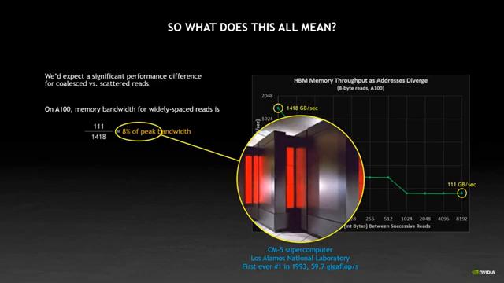

So, it really leads me into my point here. Data access patterns really matter. Most programmers know this, but it's particularly severe on the GPU because memory latencies are longer. You've got more threads so you can have more requests. HBM is a bit finicky, those types of things. So, let's take a really common data structure, a 2D array. This could be an image or a matrix. Either way, you typically lay it out in row-major format, which means adjacent memory locations are incrementing in the x direction, like I've drawn down below. I really want to be writing my array traversal like this on the left. In a row-major way, so I'm reading each column, sorry for each row, do each column, for y, do x, right? This reads adjacent values in one after the other. As most programmers know, if I instead access down a column of the code on the right, instead of along a row, my performance suddenly drops enormously. As we measured on the previous slide, it dropped by an order of magnitude

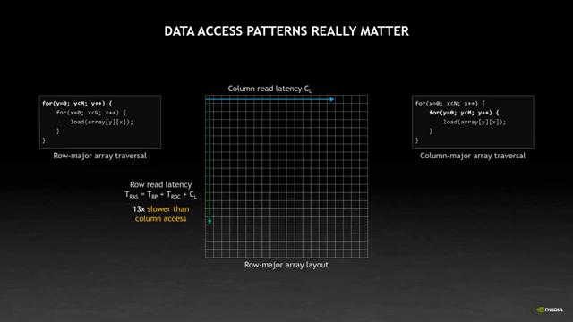

So why were we talking about this? Well, it's because what drives performance is efficient use of resources. And how does this all tend to cool? Obviously, you can't always arrange for a perfect data layout, but a factor of 13 difference in performance makes it really worth rewriting everything. You would write anything for a 10x speedup. It's also very much what it leaves to cool this programming model being the way that it

Let's start with a quick primer on how CUDA breaks work down into pieces. This is a core of CUDA's programming model, and it's probably the most important thing about CUDA, but once you get the hang of it, it's actually something you don't really think about too much. We've got this hierarchy of grids, blocks, and threads, and it's a way of subdividing the work into manageable chunks

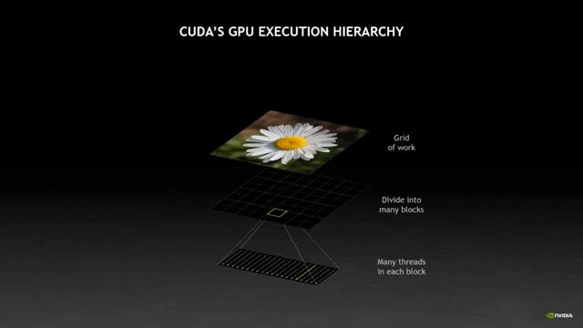

The fundamental unit of execution in CUDA is a thread block. Not the thread, not the warp, which I haven't mentioned yet, but I'll get to it. The block is really the quantum unit of parallelism on the machine, right? That's because this is the degree of parallelism you're guaranteed. You know for sure that all threads in the block are alive. So once they can work together and exchange data because they're all alive at the same time.

CUDA really presents these threads as independent, kind of like P threads if you use that. The code that you write for a CUDA thread is just like it's running on its own. Right? So in a CUDA program, it looks like a single-thread program. Each thread has its own copy of the variables and its own program counter where it is in the code. You don't have markup or pragmas or vector instructions or any of those types of things. The whole secret lies in two variables, threadIdx and blockIdx, which are automatically populated by the hardware and the block is launched to give each thread its index into the big grid of a thread circle on it. So don't worry about the program does. I'm not trying to teach you how to code. The only line that's important is this first line, where each thread uses its thread index and block index to calculate which bit of the data is working on. After that, everything in the program is the same. And this is really the core picture of how a CUDA program tends to work as everybody does the same work on slightly different data addressed by specific index. People often ask me actually what the difference is between SIMD and SIMT, right? Because CUDA says it's got a SIMT programming, right? And this line is really the fundamental difference, right? SIMD, single instruction, multiple data is running a single thread with a vector unit attached. The main thread controls everything. It controls which lines of the unit are active or inactive. It's all very explicit. You've got a lane mask based on the if condition with SIMT, single instruction, multiple thread. Thread control is implicit. Each thread has its own state. All threads are independent. Even if they're part of a vector unit, which we'll get to in a moment, they still each maintain their own state, including the index. So they can loop, they can branch, they can do conditional things, they don't all have to be running together. It's just more efficient when they are running together. And I'm going to talk about that right now.

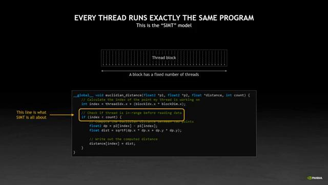

Because the GPU does run threads together in groups. It runs them in a group of 32, which we call a warp. And it does that because it's efficient in, for many reasons, to run things as a gang. But this is where it ties back into the memory story that I was telling you a moment ago. The mindedly example program, and it wouldn't expect you to have noticed. But a core piece of the program is that it's actually loading two points of data to figure out the distance between them, right? Point P1 and point P2, right? It's indexed by that really important thread ID block ID line just above, but effectively every thread is loading two values to go and calculate something about them. Well, this effectively means is that I'm loading data from 32 different threads at once, or at an offset indicated by some permutation function of a thread ID, in fact, adjacency. Now, float2 is just a structure of two floats to a size of eight bytes. This means each warp is loading 256 consecutive bytes of data, because each of its 32 threads fetches one of the values as index bytes thread ID. Thread ID is a guaranteed consecutive, which means the data access pattern is guaranteed consecutive. I get 2,256 and second bytes of data.

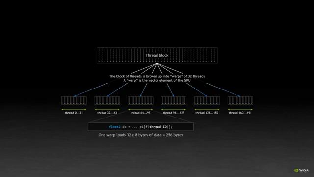

I get 2,256 and second bytes of data. The streaming multiprocessor of the SM on the GPU can manage 64 warps of threads at the same time, which is 2048 threads per SM. But as you can see from this block diagram, it really has four separate segments. So at any given time, it's really running four of those 64 warps, the other that are kept in the queue with fast switching, but that's a different discussion.

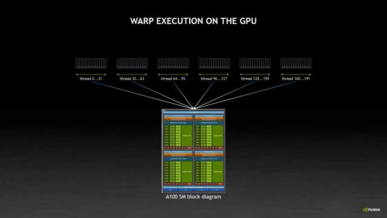

I have four of my warps, each with 32 threads, each loading my data. So, e-floating 256 bytes at the same time, that's 4 times 256 bytes, which is 1024 bytes of fully coalesced adjacent data addresses being loaded from the memory system at the same time, which if you remember is exactly the perfect size to make maximally efficient use of my memory system. It means that that load will use 100% of all the data that was fetched in the page. It puts me right at that top left

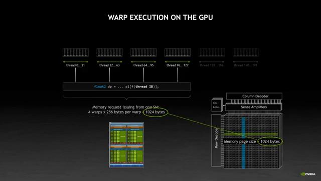

end corner by Graphigan. And this is really important, because programs read data all over the place. Even my simple example does read from two different point to read P1 and P2. It's reading 0.1.2 takes the difference, finds the distance between them. It looks like my program, at least it looks to the system like my program, is just doing random memory. There's a raise on adjacent to itself. Which, as you saw, it costs 90% of my memory performance. It is the single most important thing I care about, but in reality, because of this warp execution model, and because we're running four of them at the same time, it works out on my massively parallel CPU to be exactly the right amount of data.

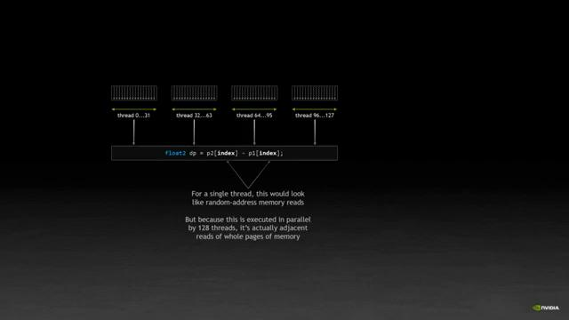

It's exactly the right amount of data to hit the peak bandwidth of my memory system. Even if my program reads data from all over the place, each read is exactly one page of my memory and lets me hit in the top-class hand corner of this graph. So if you're a CUDA programmer and you've wondered why the warp is 32 threads, this is one of the reasons. It's not an accident, the hardware design is carefully balanced the GPU to do exactly this. And so whenever someone asks me how big their thread block could be, the answer is always, nevertheless, in 128 threads. Because you always want four warps working together to make it really easy to hit peak memory performance. One warp is great. So work hard in your program to have all threads in that warp reading for meditation addresses. But you need more than one warp in your block to get all this to work perfectly.

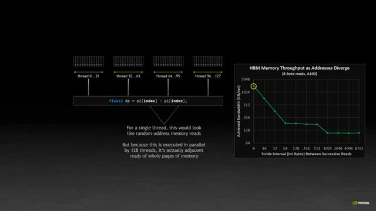

So that's a lot about memory and data, but there's more to why CUDA is the way it is and just memory bandwidth. In particular, there's a finite number of SMs, which are the SMs of the individual cores in the GPU. And inside the SM we have a fixed number of threads and other resources to play with. And so it's not just getting the memory, it's using that data efficiently as well, using all the resources you can get. I kind of see the GPU like an embedded system, where you need to be aware of what resources we're using. And you want to pack everything together to efficiently as possible.

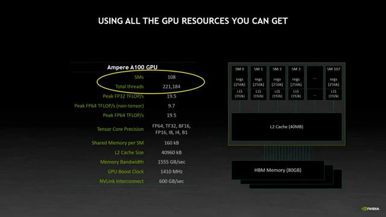

We're going to talk about something called occupancy. If memory patterns are the most important thing you can think about because they make a factor of 10 different from performance, occupancy is the next biggest because that makes an additional factor of two or a can. I'll show you in a moment.

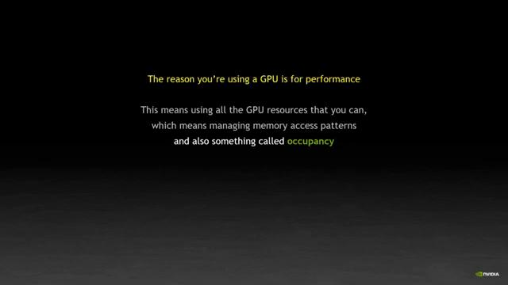

I'll show you in a moment. So, back to CUDA's execution model. I've got a grid of work divided into blocks and each block around many threads. Okay, so far so good.

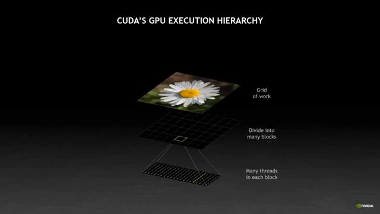

Okay, so far so good. Let's start with some work to do. Maybe I'm going to do some image processing on this picture of a flower.

Maybe I'm going to do some image processing on this picture of a flower. Break the data up into equal size of pieces. Right, this is so I can run each of the pieces independently in parallel.

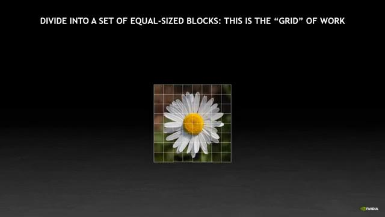

Right, this is so I can run each of the pieces independently in parallel. With the pieces are independent, they can be scheduled in any order at any time. This gives the hardware as much freedom as possible to run things efficiently. The one thing that is guaranteed, as we talked about before, is that the block will have a fixed number of threads and they're guaranteed to be running at the same time on the same SM. And I'll use this property in just a moment.

So, now I can start running my work on my GPU, or if the hardware can. Once I launch my grid to the GPU, the hardware will start placing blocks onto available SMs. Right? So, the moment on the right-hand side, I've got MTSMs and a whole grid of work to be processed. The hardware, intensely spreads them out as wide as possible. I'll get back in a minute to why they're dozens, but the spreading out of blocks is why they have to be completely independent. There's no guarantee of what block will land, where you can't guarantee the block one and block two land on the same asset. In fact, they almost certainly will not. So each block is this, this is the core of the CUDA programming, or each block is its own standalone piece of work, able to do all the processing. It needs with just the threads that it has. A hardware keeps on placing blocks onto an SM until the SM is full. I'll talk about what formally it's in a moment too. So here I'm showing that in this case two of the blocks fit onto each SM but in reality it depends on the block size. It could be anything up to 32 that's the limit. At some point all the SMs are going to be full or running work in whatever blocks they have on them or running it concurrently. Their threads are going to be used up or whatever. As of what completes its work, it will exit and the GPU hardware will place another block in the gap like this. This goes on until all my blocks have been processed and that's how we run it grid.

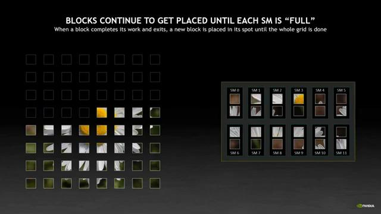

All this is CUDA 101. But I'm going to this much detail because I really want to talk about is how work is placed onto an SM. This is where we get back to our discussion about efficient use of resources. If we look inside an SM, there are a bunch of resources which it uses or which are available

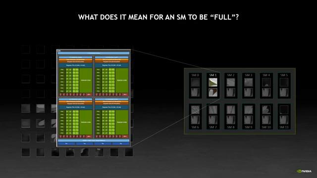

If we look inside an SM, there are a bunch of resources which it uses or which are available for running all the threads that it can. Fairly big list. It covers a lot of different things, which at least tools are some extent influenced how much work the SM can run, but by far the most important on these four at the top.

Oh, by the way, remember I said how hardware will intentionally spread blocks out across the all the SMs as widely as possible? It's because of this resource limitation down here. Right? Each SM only has a certain number of physical wires into the memory system, right? Because obviously the memory system has to support 180 SMs, it's all working at once. That means any one SM doesn't have enough on its own to maximize that one and a half terabytes per second of memory bandwidth that I have. So by spreading the blocks out across all the SMs as widely as possible, we maximize the amount of bandwidth that grid can use. Or if you like, we reduce the chance of blocks containing to the bandwidth with other SMs, while well, well, well, some SMs remain idle. Right. And so as I just spent the last 20 minutes telling you, memory bandwidth is the most precious resource of all. And so the hardware automatically spreads these things out of the way, as it can do.

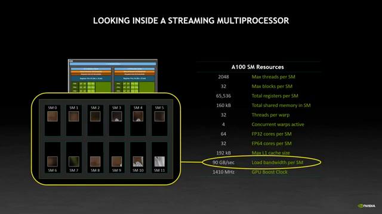

Anyway, back to the CUDA SM resources. So I'm actually going to ignore blocks per SM here because it's rare that you run to that problem, although by all means asking in the chat about when you might want to take advantage of such a large number. But we'll pay attention to these three right here.

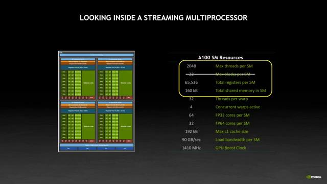

So we looked at a block running threads in the context of the memory system. Now let's look at it in terms of the other resources which are used by the thread. This is a slightly tweaked version of the code we were looking at earlier because I want to highlight resource use and not memory efficiency, but it's largely doing the same thing. Breaking down the resources. To begin with, the block has a known fixed size. You launch your grid, telling CUDA, how many threads are in in every block and every single block in the grid has that same size. So block size is one of the resources. I'm also using shared memory in this kind of. FED memories are pool of high-speed memory that all the threads in the block can use to communicate with one another, but another limited resource. And each block in this case is going to have to have some of it. Finally, there are registers. This is the working space of the thread. Register is on GPU, kind of different, to how they work on a CPU. It's determined by the compiler depending on program structure and on the complex of operations. So for example, a floating point square root toward a vision are complex arithmetic operations. They require a lot of live variables. Because memory performance is so important on the CPU, we don't rely on cache in the same way the CPU does. Instead, we have a very large register file of immediately accessible data to users of working space. So these more complex math functions are going to start using registers as their working space. It's quite common for a CUDA program to use 100 registers in every thread. Remember that all threads are running the exact same program, so they all need the exact same number of registers. So my total budget is the number of threads in my block multiplied by the number of registers. So these are the three really key things that I highlighted at the top of that SM resource table.

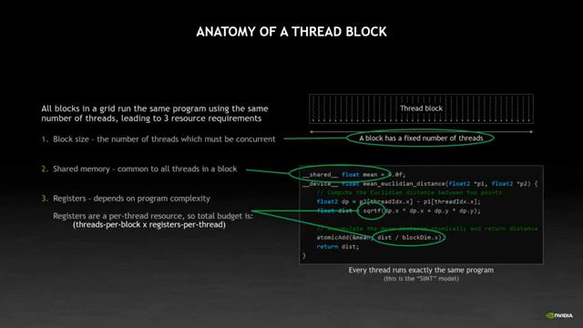

We've talked about how a grid is scheduled onto all the SMs, right? How it breaks up the blocks and spreads them around. Now let's talk about how individual blocks are placed onto a single SM. First and most importantly, a block never spans two SMs. It's always entirely resident on the single SM. If there's not enough threads left, the block can't run there. This allows threads in the block to communicate with each other. Bio-shared memory, which is one of the resources. And to synchronize with each other, a block is a cooperative array of threads. And it's the largest element with guaranteed parallelism. It's my quantum of parallelism. The hardware might run lots of blocks in parallel. It might run them one at a time. It really depends on what else is running on the GPU. But you know for certain that all threads in the block are at least alive simultaneously. So on the right-hand side here I've put in some make-believe but typical numbers that you might see for a good account. Right? Two to six threads, 64 registers per thread and 48K, I've said memory, that many, many programs have this kind of footprint. Right? And I'm going to walk you through how this affects performance and execution. So let's start by placing blocks onto the SSM. If you remember, we want to pack as many blocks as possible to maximize the number of threads that are running because ultimately my threads are doing the work. So through the more threads I have, the more efficient I'm being, even if memory access is really important, the more threads I have, the more memory I can read. So what I've done here in this picture is I've sized the blocks in my diagram of the SM according to the fraction of resources taken up. So the register is taking about a quarter of a block, and the threads are taking less. So here's the first block. It's plenty of space on the SM still, so another block will get placed on the SM as well. Both of these are running at the same time, because the SM has enough resources to run them. I'm not using all the 2048 threads of all 160K shared memory. For this example, I've kept the block numbering sequential. There was a result earlier. I've actually spread the matter across SMs. But it's easy to just look at this and then in one single picture. So the third block will fit just fine as well. But now I shared memory down the bottom there, it's looking pretty full. You can see I have room for more blocks based on the number of threads I could fit more. And I have room for another block in the register space that's left over. But there's no way to place a fourth block because of shared memory in my block needle three of these. Right, four times 48K of memory would be 192K, which is more than the 160K of this in-house. But this program is what we call shared memory occupancy limited. The first thing that I max out is shared memory. So what if I can rearrange my program in some way to use less shared memory? So that's say 32 down from 48. If it was 32, four times 32 is 128. Suddenly I could fit another block. So by dropping my shared memory, things start looking better. Although, clearly I'm now running out of registers, but I've managed to fit an extra block on the machine. So I'm not using all the shared memory anymore. I'm certainly not closely using all the machine. So I'm not using all the Fed memory anymore. I'm certainly not close to using all the threads. I've gone from being shared memory limited to register limited. I treat one variable and another one possible.

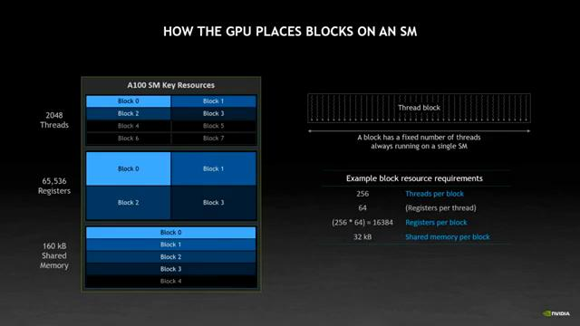

It's like some crazy four-dimensional Tetris game. You're never going to get it perfectly packed, but you just kind of do the best you can,

You're never going to get it perfectly packed, but you just kind of do the best you can, you tweak things and try and pack that extra block.

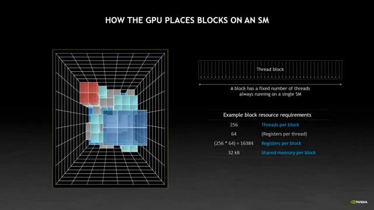

So, why do I care so much about this? It's because we're playing with this thing called occupancy, right? Which is a measure of how much stuff I can pack onto an SM. Remember, what we're trying to do here is maximize use of GPU resources. It's blocked as a certain amount of work. I usually determine bias number of threads so the more threads I can run on an SM. The more stuff I'm usually getting done. In this case, on the left, I could fit done. In this case on the left I could fit three. By adjusting my shared memory I could fit four. In fact it does my redness is maybe I'd fit five but this is the Tetris that we play. In this case the right hand side has 33% more threads active than the left, which means the GPU is cranking through my data 33% faster. Now obviously that's an ideal number. If you remember we compromised on the said memory in order to fit the extra block and so probably that cost me something. But you get the idea. I have in general occupancy is the most powerful tool you have for tuning a program. Once you're doing your best for memory access patterns, there's pretty much no algorithm or no algorithm or no algorithm or in the co-organization you can do that'll speed your program up by as much as 33%. Let's see. People work for a year to get 5% on the multi-income code. For the case where I've gone from occupancy in 1 to 2, that would actually double my performance. So likewise, getting it wrong can easily cost you 50%. If you add a bit of extra-fed memory and in boom, you suddenly drop a block and you've instead of gaining 33% you've lost 33% right? That's easily done too. So a key part when you're looking at how your program works is to always check your occupancy. Obviously, it's not always possible to reduce these other key resource, just like it's not always possible to change my memory layout, but just like memory layout, I actually think about this right at the start when I'm planning my algorithm and designing my program. I intentionally design with occupancy in mind because this is the second biggest lever that I have to pull.

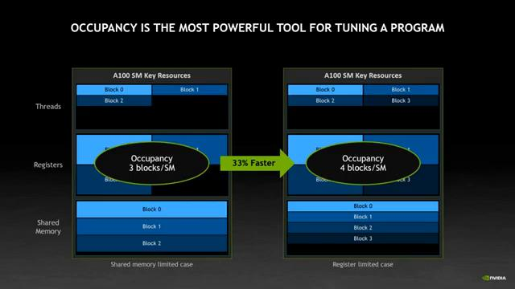

So this is my SM completely filled, right, with the grid that we're looking at at least. And with that particular pattern of resources, but I'm still not using half my threads. And I've still got a quarter of my registers free. We're going to try and fill in the gaps. As it happens, the GPU can run many things at once, right? It can actually run up to 128 different programs at once. So if we're not completely filling up the GPU with one thing, we can try and tetris into another right next to it. Let's think about another grid. This time it has a very large number of threads and a very small number of registers per thread and no shared memory. Obviously it's a little contrived, but actually this will be typical of a data movement kernel, something we should maybe do in a sort or just simply copying data from one place to another. So this would be a mem copy kind. The GPU is smart enough to say, well, I can't fit any more of the blue grid in. Let's try the green grid. And it'll pack a block of that green grid into the gap to compact too because I've run out of registers. But I'm running 66% more threads than I was before. That's basically free performance. Our Tetris problem just gained yet another dimension, but the hardware does all this for us so as long as you have multiple grids available to run, the hardware will try and drop them in.

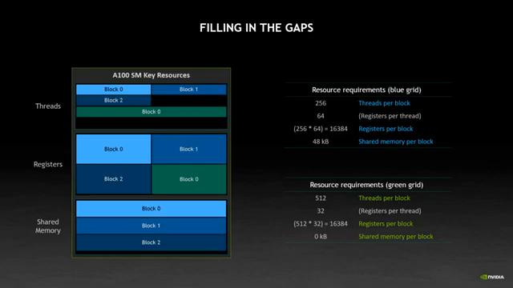

So this brings me to the next really important thing about CUDA, which is concurrency. The GPU is massively parallel on all sorts of different levels and to make the most of it you need to throw as many things at it as you can. And in the previous example, I was packing both my image processing kernel and the bonus copy kernel onto the GPU. And to do this, obviously, I'd have to be copying different data from what I'm actually processing. The key thing here, though, is we need to tell the GPU that these things are independent. I'll show you what I mean.

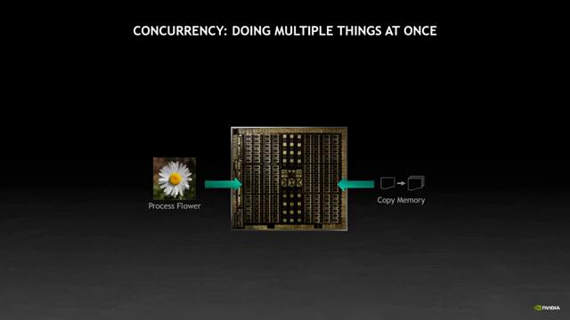

I'll show you what I mean. The key topic is dependencies. Or more importantly, avoiding them where possible. Usually it's pretty obvious. So for example, I'm copying this flower up to the GPU, then I'm processing it, then I'm copying it back. And those operations have to be done one after another. There's no point copying the result before it's processed, right? Now, let's say I want to do another file. The simple thing to do is just to string the sequence of operations together. But obviously, the second flower is not really dependent on the first flower. I could do them both at the same time if they're spacing on the GPU to do it.

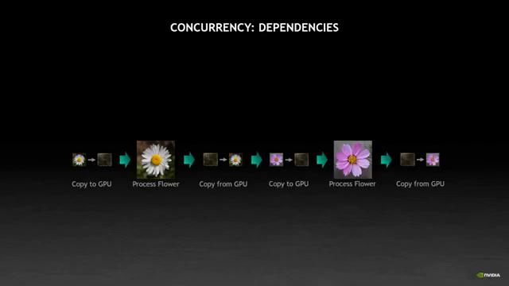

So in CUDA, we tell the GPU about this independence between the works using this concept of streams of work. Each stream is an independent work queue. And by submitting work to different streams, you tell CUDA and hence the hardware, what can be overlapped on the GPU at the same time. As we saw with the occupancy discussion, what will actually happen is the GPU will pack the pieces of work which fit together. It can't fit blocks of flower processing from both the blue and the green stream at the same time because if you remember the SM is shared memory limit. But it can fit the green copy alongside the blue flower, as we saw earlier.

What will naturally happen then is the two streams will shift in time as the GPU finds ways to play Tetris with the independent work and pack things together as tightly as possible. This is a thing called oversubscription where there is so much work available that the GPU can spend all of its effort packing things into little corners and getting end to end throughput to be as high as possible. The more you can oversubscribe the GPU, the better job it'll do at getting through all the work. There's a ton of hardware specialized at playing, for dimensional Tetris, with dozens of different pieces of work. So by simply thinking about what pieces of your workflow are independent from each other, you turn on all that hardware and then it figure out the best schedule.

So, I'm going to have to wrap it up here. I had something like 130 slides of material, but I obviously can't fit them all in the time available. So, I just have to go another talk next year. Anyway, let's recap what we've seen today to try to frame the answer to our original question. You know, why this could have a way that it is.

You know, why this could have a way that it is. We started out with a problem that memory system can only feed about one sixth of what the execution resources can request. So our primary limiting factor is memory.

So our primary limiting factor is memory. But we saw that memory system itself depends on good access patterns. The laws of physics regarding capacity and the stick tape that randomly reading memory is much more expensive than reading it linearly.

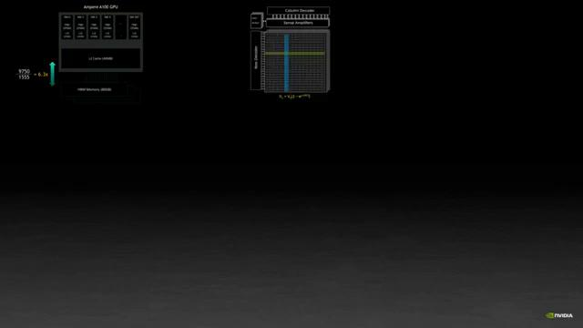

is much more expensive than reading it linearly. And we learned that if we get it wrong, we slow everything down by 92%. That's on top of already being limited by the performance of the memory system compared with what the SM is one. So the story got a bit bad. But we learned that warp execution system, the GPU, can save it by reading from lots of threads at once. But that we need all the threads in the warp

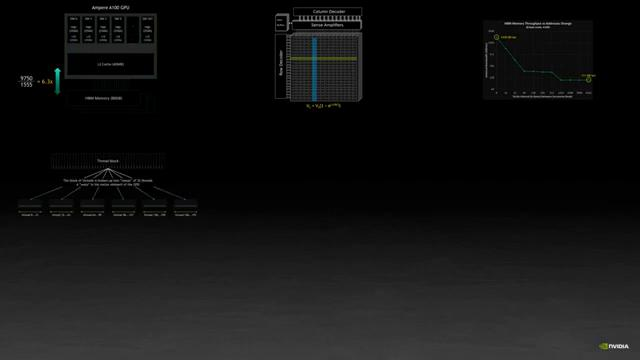

But that we need all the threads in the warp to be working on adjacent data, and that all the thread blocks are better have a minimum of 128 threads so that I can issue these maximum forms for faster memory system.

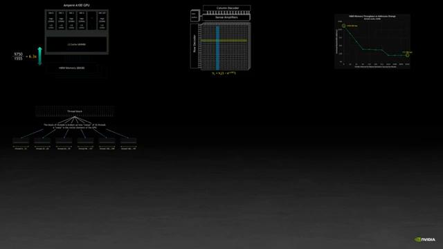

We learn that the hardware spreads blocks out as widely as possible across the SNs to maximize the memory bandwidth that they can request.

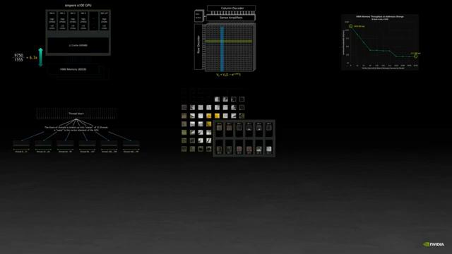

to maximize the memory bandwidth that they can request. And we learn that resource packing limitations have the second biggest impact on performance, as much as the factor of two, and that a small change in a resource, like shared memory going on before the AKA the 32K, can make a big difference in program performance. We learned that the hardware can play a pretty good game of four-dimensional Tetris, but that we need to feed it a lot of concurrent work through over subscription so that it can pack things efficiently. And so in all these ways, could as programming model represents the properties of the hardware it runs on. And that hardware has these properties because it's in a constant battle for efficiency against the laws of physics, which means fundamentally, like I said at the beginning, could work the way it does because of physics.

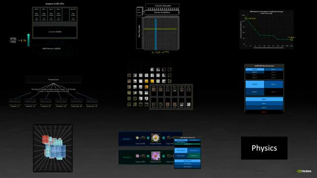

You know, my aim when I'm talking about how could in the GPU works is not to tell people how to write CUDA. That's both more than an hour and also the answer is simply C++ for most part. I really want to give you a feel for how a program runs on the GPU, right, for what you need to pay attention to, because you want to make the most out of it, and because they're a weird pitfalls you might not expect, right? Mostly, I'd just want to help you build a mental model of how things work by expanding and why things work the way they do. Good programming works through thinking carefully about your memory layout and about how to fit as much stuff as possible on the machine. And maybe just a teeny tiny bit about optimizing your code. But to be honest, if you get memory and occupancy and concurrency right, there's not much left to optimize. Right? If members, you end up getting 50% of the peak performance concurrency right, there's not much left to optimize. If members, you end up getting 50% of the peak performance of the GPU, that's still 10 teraflops of floating point compute, which is huge. And getting the remaining 50% is going to be so much work. So if you're going to do just three things, look at your memory layout, look at how well your things are packing on your SMs, how well the Tetris is doing, and make sure that you've told the GPU all the different pieces they're independent. And I don't have to do much more than that. Anyway, I hope it's been fun for you. Thank you all so much for listening to me going about CUDA. Until next time.

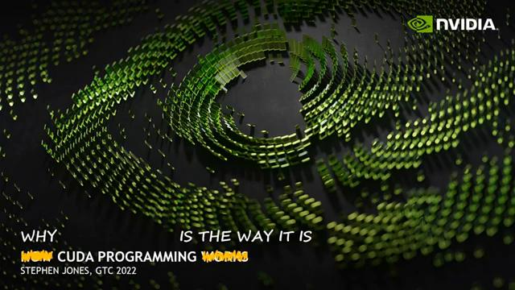